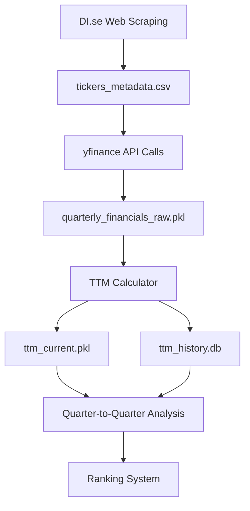

# Data Pipeline Redesign: From Ticker Scraping to TTM Rankings

## Overview
This document outlines the redesigned data pipeline for the Indicatum stock analysis platform, focusing on consistent quarterly-to-quarterly comparisons to maintain ranking precision throughout the reporting cycle.

## Current Problem
The existing pipeline compares TTM (quarterly-rolling) data with Latest (annual snapshot) data, causing:
- Artificial ranking volatility that doesn't reflect real business changes
- Precision loss over quarterly reporting cycles (Month 1-3: accurate, Month 10-12: meaningless)
- Inconsistent comparison baselines (quarterly vs annual)

## Redesigned Pipeline Goals
1. **Consistent Temporal Comparisons**: Quarter-to-quarter or TTM-to-TTM comparisons only
2. **Maintained Precision**: Rankings remain meaningful throughout entire reporting cycle  
3. **Real Business Changes**: Capture actual performance improvements/deteriorations
4. **Scalable Architecture**: Support for 700+ Swedish stocks with efficient data handling

---

## Stage 1: Ticker Discovery and Classification

### Purpose
Discover and classify all tradeable Swedish stocks across market segments with comprehensive metadata collection.

### Input Sources
- **Primary**: DI.se (Dagens Industri) market listings
- **Secondary**: Nasdaq Stockholm official listings (fallback/validation)
- **Tertiary**: Manual ticker additions for edge cases

### Process Flow
```
Web Scraping → Data Validation → Classification → Storage
```

### Implementation (`scrape_tickers.py`)
```python
def scrape_market_tickers():
    """
    Scrape tickers from DI.se across all market segments
    Returns: DataFrame with ticker, segment, sector information
    """
    markets = ['large-cap', 'mid-cap', 'small-cap', 'first-north']
    # Implementation details...
```

### Data Schema
| Column | Type | Description | Example |
|--------|------|-------------|---------|
| ticker | string | Stock symbol without .ST suffix | "ASSA-B" |
| ticker_yf | string | yfinance-compatible symbol | "ASSA-B.ST" |
| market_segment | string | Market classification | "LargeCap" |
| sector | string | Business sector (Swedish) | "Sällanköpsvaror" |
| company_name | string | Official company name | "ASSA ABLOY AB" |
| scrape_date | datetime | When ticker was discovered | "2025-09-16" |
| is_active | boolean | Currently trading | true |

### Output Storage
**File**: `data/{environment}/tickers_metadata.csv`
**Format**: CSV with UTF-8 encoding for Swedish characters
**Size Estimate**: ~1000 rows × 7 columns ≈ 100KB

### Quality Controls
- **Duplicate Detection**: Remove duplicate tickers across segments
- **Symbol Validation**: Verify .ST suffix compatibility
- **Sector Mapping**: Standardize sector names to Swedish conventions
- **Trading Status**: Flag inactive/delisted tickers

### Environment Handling
```python
ENVIRONMENT = os.getenv('ENVIRONMENT', 'local')
OUTPUT_PATH = Path('data') / ('local' if ENVIRONMENT == 'local' else 'remote')
```

---

## Stage 2: Quarterly Financial Data Acquisition

### Purpose
Systematically download quarterly financial statements for all Swedish stocks with comprehensive error handling and data validation.

### Input
- `tickers_metadata.csv`: List of validated tickers
- yfinance API: Quarterly financial data source

### Process Flow
```
Ticker List → yfinance API → Data Validation → Quality Control → Storage
```

### Implementation (`quarterly_data_fetcher.py`)
```python
def fetch_quarterly_financials(ticker: str, periods: int = 16) -> Dict:
    """
    Fetch 16 quarters (4 years) of quarterly data
    Returns: Structured financial data with metadata
    """
    # Fetch income statement, balance sheet, cash flow
    # Handle API rate limits and errors
    # Validate data completeness
```

### Data Categories

#### Financial Statements (Quarterly)
1. **Income Statement**
   - Total Revenue (Nettoomsättning)
   - Operating Income (Rörelseresultat)
   - Net Income (Nettoresultat)
   - EBITDA (calculated)
   - Basic EPS (Resultat per aktie)

2. **Balance Sheet**
   - Total Assets (Totala tillgångar)
   - Stockholders Equity (Eget kapital)
   - Total Debt (Total skuld)
   - Cash and Cash Equivalents (Kassa och banktillgodohavanden)

3. **Cash Flow Statement**
   - Operating Cash Flow (Kassaflöde från verksamheten)
   - Free Cash Flow (calculated)

#### Market Data (Daily)
- Current Price (Aktuell kurs)
- Shares Outstanding (Antal aktier)
- Market Capitalization (Börsvärde)

### Data Schema
#### Core Financial Data
| Field | Type | Description | Source |
|-------|------|-------------|--------|
| ticker | string | Stock symbol | Input |
| period_end | date | Quarter end date | yfinance |
| fiscal_year | int | Fiscal year | yfinance |
| fiscal_quarter | int | Fiscal quarter (1-4) | yfinance |
| total_revenue | float | Revenue (SEK millions) | Income Statement |
| operating_income | float | Operating income (SEK millions) | Income Statement |
| net_income | float | Net income (SEK millions) | Income Statement |
| ebitda | float | Calculated EBITDA | Calculated |
| total_assets | float | Total assets (SEK millions) | Balance Sheet |
| stockholders_equity | float | Equity (SEK millions) | Balance Sheet |
| total_debt | float | Total debt (SEK millions) | Balance Sheet |
| operating_cash_flow | float | Operating CF (SEK millions) | Cash Flow |
| shares_outstanding | float | Shares outstanding | Market Data |
| data_quality_score | float | Completeness metric (0-1) | Calculated |

### Output Storage

#### Primary Storage: Structured Pickle Files
**File**: `data/{environment}/quarterly_financials_raw.pkl`
**Format**: Pandas DataFrame with MultiIndex (ticker, period_end)
**Size Estimate**: 700 tickers × 16 quarters × 15 fields ≈ 50MB
**Benefits**: Fast loading, preserves data types, handles complex indexes

#### Secondary Storage: CSV for Human Review
**File**: `data/{environment}/quarterly_financials_summary.csv`
**Format**: Flattened CSV for manual inspection
**Size Estimate**: Same data in human-readable format ≈ 20MB

#### Metadata Storage
**File**: `data/{environment}/data_fetch_log.json`
**Content**: Fetch timestamps, error logs, completion rates per ticker

### Data Quality Framework

#### Completeness Metrics
- **Field Coverage**: Percentage of non-null values per field
- **Time Series Coverage**: Number of complete quarters per ticker
- **Overall Quality Score**: Weighted average across all metrics

#### Error Handling
```python
class DataQualityMetrics:
    def calculate_completeness(self, df: pd.DataFrame) -> float:
        """Calculate data completeness score (0-1)"""
        
    def identify_missing_periods(self, df: pd.DataFrame) -> List[str]:
        """Identify missing quarterly reports"""
        
    def flag_outliers(self, df: pd.DataFrame) -> pd.DataFrame:
        """Flag statistical outliers for manual review"""
```

#### Validation Rules
- **Revenue Positivity**: Total revenue should be positive (except special cases)
- **Balance Sheet Equation**: Assets = Liabilities + Equity (within tolerance)
- **Time Series Consistency**: No impossible period-over-period changes (>500% growth)
- **Currency Consistency**: All values in SEK millions

### Environment Configuration
```python
# Rate limiting for yfinance API
API_DELAY = 0.1  # seconds between requests
BATCH_SIZE = 50  # tickers per batch
MAX_RETRIES = 3  # retry failed requests

# Data quality thresholds
MIN_COMPLETENESS = 0.7  # 70% field coverage required
MIN_QUARTERS = 8  # At least 8 quarters of data
```

---

## Stage 3: TTM Data Calculation and Historical Tracking

### Purpose
Convert quarterly data into rolling Trailing Twelve Months (TTM) calculations and maintain historical TTM snapshots for consistent quarter-to-quarter comparisons.

### Input
- `quarterly_financials_raw.pkl`: Raw quarterly financial data
- `ttm_history.db`: Historical TTM snapshots (if exists)

### Process Flow
```
Quarterly Data → TTM Calculation → Historical Comparison → Storage
```

### TTM Calculation Methodology

#### Rolling TTM Principle
For any given date, TTM represents the sum of the most recent 4 quarters:
```
TTM_Q3_2025 = Q3_2025 + Q2_2025 + Q1_2025 + Q4_2024
TTM_Q2_2025 = Q2_2025 + Q1_2025 + Q4_2024 + Q3_2024
```

#### Implementation (`ttm_calculator.py`)
```python
def calculate_ttm_metrics(quarterly_df: pd.DataFrame) -> pd.DataFrame:
    """
    Calculate rolling TTM values for all financial metrics
    """
    # Group by ticker
    # Sort by period_end
    # Apply rolling 4-quarter sum for income/cash flow items
    # Use most recent quarter for balance sheet items
    # Calculate derived ratios (ROE, ROIC, margins)
```

### TTM Metrics Categories

#### Summable Metrics (4-quarter rolling sum)
- Total Revenue TTM
- Operating Income TTM
- Net Income TTM
- EBITDA TTM
- Operating Cash Flow TTM
- Free Cash Flow TTM

#### Point-in-Time Metrics (most recent quarter)
- Total Assets
- Stockholders Equity
- Total Debt
- Cash and Cash Equivalents
- Shares Outstanding
- Market Capitalization

#### Calculated Ratios (TTM)
- ROE TTM = Net Income TTM / Stockholders Equity
- ROIC TTM = Operating Income TTM / Invested Capital
- Operating Margin TTM = Operating Income TTM / Revenue TTM
- Net Margin TTM = Net Income TTM / Revenue TTM
- Debt-to-Equity TTM = Total Debt / Stockholders Equity

### Historical TTM Database Schema

#### SQLite Database Structure
**File**: `data/local/ttm_history.db` (always local, even in remote environment)

```sql
CREATE TABLE ttm_snapshots (
    id INTEGER PRIMARY KEY AUTOINCREMENT,
    ticker TEXT NOT NULL,
    snapshot_date DATE NOT NULL,
    metric_name TEXT NOT NULL,
    metric_value REAL,
    data_quality_score REAL,
    fiscal_periods_included TEXT, -- JSON array of included quarters
    created_timestamp DATETIME DEFAULT CURRENT_TIMESTAMP,
    UNIQUE(ticker, snapshot_date, metric_name)
);

CREATE INDEX idx_ticker_date ON ttm_snapshots(ticker, snapshot_date);
CREATE INDEX idx_metric_date ON ttm_snapshots(metric_name, snapshot_date);
```

#### Data Storage Strategy
- **Monthly Snapshots**: Capture TTM calculations monthly for trend analysis
- **Quarterly Snapshots**: Detailed snapshots aligned with earnings seasons
- **Change Detection**: Automatic flagging of significant TTM changes

### TTM Quality Controls

#### Data Validation
```python
class TTMValidator:
    def validate_ttm_calculation(self, ticker: str, ttm_data: Dict) -> bool:
        """Validate TTM calculations against source quarters"""
        
    def check_temporal_consistency(self, ttm_series: pd.Series) -> List[str]:
        """Identify impossible TTM changes"""
        
    def calculate_confidence_score(self, quarterly_coverage: float) -> float:
        """Calculate confidence in TTM calculation (0-1)"""
```

#### Quality Metrics
- **Quarterly Coverage**: Percentage of quarters with complete data
- **Calculation Confidence**: Reliability score for each TTM metric
- **Temporal Consistency**: Smoothness of TTM progression over time

### Output Storage

#### Primary TTM Data
**File**: `data/{environment}/ttm_current.pkl`
**Format**: Pandas DataFrame with DatetimeIndex
**Content**: Most recent TTM calculations for all tickers
**Size Estimate**: 700 tickers × 25 TTM metrics ≈ 5MB

#### Historical TTM Archive
**Database**: `data/local/ttm_history.db`
**Content**: Complete historical TTM snapshots with metadata
**Size Estimate**: 700 tickers × 25 metrics × 48 months ≈ 200MB after 4 years

#### TTM Summary Report
**File**: `data/{environment}/ttm_summary.csv`
**Content**: Latest TTM values with quality scores
**Purpose**: Human review and validation

### Quarter-to-Quarter Comparison Framework

#### Comparison Methodology
Instead of TTM vs Latest Annual, compare:
1. **Current TTM vs Previous Quarter TTM**: 3-month business changes
2. **Current TTM vs Same Quarter Last Year TTM**: Annual progress tracking
3. **TTM Trend Analysis**: 4-quarter rolling trend direction

#### Implementation
```python
def calculate_ttm_changes(current_ttm: pd.DataFrame, 
                         historical_ttm: pd.DataFrame) -> pd.DataFrame:
    """
    Calculate meaningful TTM-to-TTM changes
    Returns: DataFrame with change metrics and significance flags
    """
    # Quarter-over-quarter TTM changes
    # Year-over-year TTM changes  
    # Statistical significance testing
    # Business materiality thresholds
```

### Performance Optimization

#### Data Loading Strategy
- **Lazy Loading**: Load only required date ranges
- **Caching**: Cache frequently accessed TTM calculations
- **Incremental Updates**: Only recalculate changed tickers

#### Memory Management
- **Chunked Processing**: Process tickers in batches to manage memory
- **Data Type Optimization**: Use appropriate numeric types (float32 vs float64)
- **Garbage Collection**: Explicit cleanup of large DataFrames

---

## Data Flow Summary



## Implementation Timeline

### Phase 1: Data Acquisition (Week 1)
- [ ] Implement enhanced ticker scraping
- [ ] Build robust quarterly data fetcher
- [ ] Establish data quality framework

### Phase 2: TTM Engine (Week 2)  
- [ ] Develop TTM calculation engine
- [ ] Create historical TTM database
- [ ] Implement validation and quality controls

### Phase 3: Integration (Week 3)
- [ ] Connect to existing ranking system
- [ ] Update quarterly analysis engine
- [ ] Test end-to-end pipeline

## Success Metrics

### Data Quality
- **Completeness**: >90% field coverage across all tickers
- **Temporal Coverage**: >95% of expected quarterly reports captured
- **Accuracy**: <1% calculation errors in TTM metrics

### Performance
- **Processing Time**: Complete pipeline execution <30 minutes
- **Memory Usage**: Peak memory usage <8GB for full dataset
- **API Efficiency**: <2 failed requests per 100 API calls

### Business Impact
- **Ranking Stability**: TTM rankings maintain precision throughout quarterly cycle
- **Change Detection**: Identify real business changes vs data artifacts
- **Content Quality**: Automated analysis produces actionable insights

This redesigned pipeline foundation ensures consistent, precise rankings that reflect real business performance rather than data collection timing artifacts.