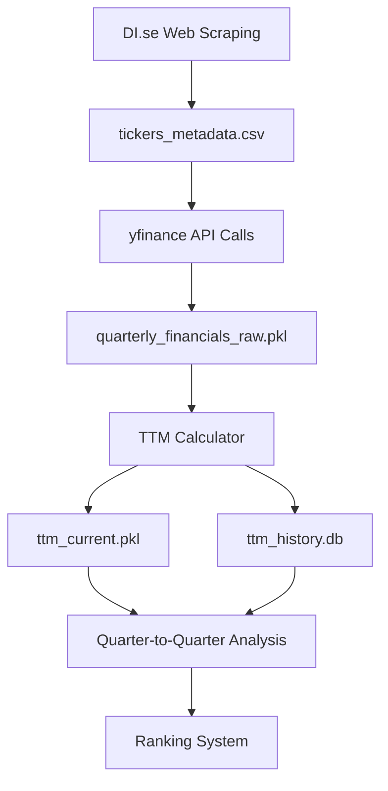

# Data Pipeline Redesign: From Ticker Scraping to TTM Rankings

## Overview
This document outlines the redesigned data pipeline for the Indicatum stock analysis platform, focusing on consistent quarterly-to-quarterly comparisons to maintain ranking precision throughout the reporting cycle.

## Current Problem
The existing pipeline compares TTM (quarterly-rolling) data with Latest (annual snapshot) data, causing:
- Artificial ranking volatility that doesn't reflect real business changes
- Precision loss over quarterly reporting cycles (Month 1-3: accurate, Month 10-12: meaningless)
- Inconsistent comparison baselines (quarterly vs annual)

## Redesigned Pipeline Goals
1. **Consistent Temporal Comparisons**: TTM-to-TTM comparisons only (comparing current TTM vs previous quarter TTM, or current TTM vs same quarter last year TTM)
2. **Maintained Precision**: Rankings remain meaningful throughout entire reporting cycle  
3. **Real Business Changes**: Capture actual performance improvements/deteriorations
4. **Scalable Architecture**: Support for 700+ Swedish stocks with efficient data handling

---

## Stage 1: Ticker Discovery and Classification

### Purpose
Discover and classify all tradeable Swedish stocks across market segments with comprehensive metadata collection.

### Input Sources
- **Primary**: DI.se (Dagens Industri) market listings
- **Secondary**: Nasdaq Stockholm official listings (fallback/validation)
- **Tertiary**: Manual ticker additions for edge cases

### Process Flow
```
Web Scraping → Data Validation → Classification → Storage
```

### Implementation (`scrape_tickers.py`)
```python
def scrape_market_tickers():
    """
    Scrape tickers from DI.se across all market segments
    Returns: DataFrame with ticker, segment, sector information
    """
    markets = ['large-cap', 'mid-cap', 'small-cap', 'first-north']
    # Implementation details...
```

### Data Schema
| Column | Type | Description | Example |
|--------|------|-------------|---------|
| ticker | string | Stock symbol without .ST suffix | "ASSA-B" |
| ticker_yf | string | yfinance-compatible symbol | "ASSA-B.ST" |
| market_segment | string | Market classification | "LargeCap" |
| sector | string | Business sector (Swedish) | "Sällanköpsvaror" |
| company_name | string | Official company name | "ASSA ABLOY AB" |
| scrape_date | datetime | When ticker was discovered | "2025-09-16" |
| is_active | boolean | Currently trading | true |

### Output Storage
**File**: `data/{environment}/tickers_metadata.csv`
**Format**: CSV with UTF-8 encoding for Swedish characters
**Size Estimate**: ~1000 rows × 7 columns ≈ 100KB

### Quality Controls
- **Duplicate Detection**: Remove duplicate tickers across segments
- **Symbol Validation**: Verify .ST suffix compatibility
- **Sector Mapping**: Standardize sector names to Swedish conventions
- **Trading Status**: Flag inactive/delisted tickers

### Environment Handling
```python
ENVIRONMENT = os.getenv('ENVIRONMENT', 'local')
OUTPUT_PATH = Path('data') / ('local' if ENVIRONMENT == 'local' else 'remote')
```

---

## Stage 2: Quarterly Financial Data Acquisition

### Purpose
Systematically download quarterly financial statements for all Swedish stocks with comprehensive error handling and data validation.

### Input
- `tickers_metadata.csv`: List of validated tickers
- yfinance API: Quarterly financial data source

### Process Flow
```
Ticker List → Data Freshness Check → Incremental yfinance API → Data Validation → Quality Control → Storage
```

### Implementation (`quarterly_data_fetcher.py`)
```python
def fetch_quarterly_financials(ticker: str, periods: int = 16, force_refresh: bool = False) -> Dict:
    """
    Intelligently fetch quarterly data with incremental updates
    
    Args:
        ticker: Stock symbol to fetch
        periods: Total quarters to maintain (16 = 4 years)
        force_refresh: If True, fetch all data regardless of cache
        
    Returns: 
        Structured financial data with metadata
        
    Strategy:
        1. Check existing data freshness in storage
        2. Determine which quarters need updating
        3. Fetch only missing/stale data from yfinance
        4. Merge with existing data to maintain full 16-quarter history
    """
    existing_data = load_existing_quarterly_data(ticker)
    
    if not force_refresh and existing_data is not None:
        # Smart incremental update logic
        quarters_to_fetch = identify_missing_quarters(existing_data, periods)
        if not quarters_to_fetch:
            return existing_data  # Data is fresh, no API call needed
    else:
        # Full refresh - fetch all 16 quarters
        quarters_to_fetch = periods
        
    # Fetch only necessary data from yfinance API
    new_data = fetch_from_yfinance(ticker, quarters_to_fetch)
    
    # Merge with existing data and validate
    merged_data = merge_quarterly_data(existing_data, new_data)
    return validate_and_clean(merged_data)

def identify_missing_quarters(existing_data: Dict, required_periods: int) -> List[str]:
    """
    Determine which quarters need to be fetched based on:
    1. Missing quarters in the 16-quarter window
    2. Data older than quarterly earnings season (stale data)
    3. Data quality issues flagged in previous runs
    """
    # Implementation for smart quarter detection

def load_existing_quarterly_data(ticker: str) -> Optional[Dict]:
    """Load cached quarterly data from pickle files with metadata"""
    # Check data/{environment}/quarterly_financials_raw.pkl for existing data
    
def is_data_fresh(latest_quarter_date: pd.Timestamp) -> bool:
    """
    Determine if existing data is fresh enough to skip API calls
    
    Freshness rules:
    - Data from current quarter: Fresh for 30 days after quarter end
    - Data from previous quarter: Fresh for 7 days after earnings season
    - Older data: Considered stale, needs refresh
    """
    today = pd.Timestamp.now()
    quarter_end = get_quarter_end_date(latest_quarter_date)
    days_since_quarter_end = (today - quarter_end).days
    
    # During earnings season (30-45 days after quarter end), refresh more frequently
    if 30 <= days_since_quarter_end <= 45:
        return days_since_quarter_end < 7  # Refresh weekly during earnings season
    else:
        return days_since_quarter_end < 30  # Monthly refresh otherwise
```

### Data Categories

#### Financial Statements (Quarterly)
1. **Income Statement**
   - Total Revenue (Nettoomsättning)
   - Operating Income (Rörelseresultat)
   - Net Income (Nettoresultat)
   - EBITDA (calculated)
   - Basic EPS (Resultat per aktie)

2. **Balance Sheet**
   - Total Assets (Totala tillgångar)
   - Stockholders Equity (Eget kapital)
   - Total Debt (Total skuld)
   - Cash and Cash Equivalents (Kassa och banktillgodohavanden)

3. **Cash Flow Statement**
   - Operating Cash Flow (Kassaflöde från verksamheten)
   - Free Cash Flow (calculated)

#### Market Data (Daily)
- Current Price (Aktuell kurs)
- Shares Outstanding (Antal aktier)
- Market Capitalization (Börsvärde)

### Data Schema
#### Core Financial Data
| Field | Type | Description | Source |
|-------|------|-------------|--------|
| ticker | string | Stock symbol | Input |
| period_end | date | Quarter end date | yfinance |
| fiscal_year | int | Fiscal year | yfinance |
| fiscal_quarter | int | Fiscal quarter (1-4) | yfinance |
| total_revenue | float | Revenue (SEK millions) | Income Statement |
| operating_income | float | Operating income (SEK millions) | Income Statement |
| net_income | float | Net income (SEK millions) | Income Statement |
| ebitda | float | Calculated EBITDA | Calculated |
| total_assets | float | Total assets (SEK millions) | Balance Sheet |
| stockholders_equity | float | Equity (SEK millions) | Balance Sheet |
| total_debt | float | Total debt (SEK millions) | Balance Sheet |
| operating_cash_flow | float | Operating CF (SEK millions) | Cash Flow |
| shares_outstanding | float | Shares outstanding | Market Data |
| data_quality_score | float | Completeness metric (0-1) | Calculated |

### Output Storage

#### Primary Storage: Structured Pickle Files
**File**: `data/{environment}/quarterly_financials_raw.pkl`
**Format**: Pandas DataFrame with MultiIndex (ticker, period_end)
**Size Estimate**: 700 tickers × 16 quarters × 15 fields ≈ 50MB
**Benefits**: Fast loading, preserves data types, handles complex indexes

#### Secondary Storage: CSV for Human Review
**File**: `data/{environment}/quarterly_financials_summary.csv`
**Format**: Flattened CSV for manual inspection
**Size Estimate**: Same data in human-readable format ≈ 20MB

#### Metadata Storage
**File**: `data/{environment}/data_fetch_log.json`
**Content**: Fetch timestamps, error logs, completion rates per ticker

### Data Quality Framework

#### Completeness Metrics
- **Field Coverage**: Percentage of non-null values per field
- **Time Series Coverage**: Number of complete quarters per ticker
- **Overall Quality Score**: Weighted average across all metrics

#### Error Handling
```python
class DataQualityMetrics:
    def calculate_completeness(self, df: pd.DataFrame) -> float:
        """Calculate data completeness score (0-1)"""
        
    def identify_missing_periods(self, df: pd.DataFrame) -> List[str]:
        """Identify missing quarterly reports"""
        
    def flag_outliers(self, df: pd.DataFrame) -> pd.DataFrame:
        """Flag statistical outliers for manual review"""
```

#### Validation Rules
- **Revenue Positivity**: Total revenue should be positive (except special cases)
- **Balance Sheet Equation**: Assets = Liabilities + Equity (within tolerance)
- **Time Series Consistency**: No impossible period-over-period changes (>500% growth)
- **Currency Consistency**: All values in SEK millions

### Environment Configuration
```python
# Rate limiting for yfinance API
API_DELAY = 0.1  # seconds between requests
BATCH_SIZE = 50  # tickers per batch
MAX_RETRIES = 3  # retry failed requests

# Data quality thresholds
MIN_COMPLETENESS = 0.7  # 70% field coverage required
MIN_QUARTERS = 8  # At least 8 quarters of data
```

### Incremental Data Collection Strategy

#### Smart Update Logic
The quarterly data fetcher implements intelligent caching to minimize API calls and improve performance:

```python
class QuarterlyDataManager:
    """Manages incremental quarterly data collection with smart caching"""
    
    def daily_update_routine(self, tickers: List[str]) -> Dict[str, str]:
        """
        Daily automated update process
        
        Returns: Summary of update actions taken per ticker
        """
        update_summary = {}
        
        for ticker in tickers:
            try:
                # 1. Load existing data with metadata
                existing_data, last_update = self.load_with_metadata(ticker)
                
                # 2. Determine update necessity
                update_needed = self.needs_update(ticker, existing_data, last_update)
                
                if update_needed:
                    # 3. Fetch only necessary quarters
                    new_data = self.fetch_incremental_data(ticker, existing_data)
                    
                    # 4. Merge and validate
                    updated_data = self.merge_and_validate(existing_data, new_data)
                    
                    # 5. Save with new timestamp
                    self.save_with_metadata(ticker, updated_data)
                    update_summary[ticker] = "UPDATED"
                else:
                    update_summary[ticker] = "FRESH_CACHE"
                    
            except Exception as e:
                update_summary[ticker] = f"ERROR: {str(e)}"
                
        return update_summary
    
    def needs_update(self, ticker: str, existing_data: Dict, last_update: pd.Timestamp) -> bool:
        """
        Determine if ticker needs data refresh based on:
        1. Time since last update
        2. Earnings season proximity
        3. Data completeness gaps
        4. Manual force refresh flags
        """
        if existing_data is None:
            return True  # No existing data
            
        # DAILY CHECK: Always check for new quarterly reports
        # Swedish companies publish quarterly reports on different dates throughout earnings seasons
        # Users need TTM changes calculated as soon as new quarterly data becomes available
        
        # Check if any new quarterly reports were published since last update
        new_quarterly_data_available = self.check_for_new_quarterly_reports(ticker, last_update)
        if new_quarterly_data_available:
            return True  # New quarterly report detected - immediate update required
        
        days_since_update = (pd.Timestamp.now() - last_update).days
        
        # Check daily for new quarterly reports throughout the year
        # Swedish companies publish quarterly reports on different dates, not seasonally clustered
        return days_since_update >= 1  # Daily check for all periods
            
        # Additional checks for data gaps
        if self.has_data_quality_issues(existing_data):
            return True
            
        return False
    
    def check_for_new_quarterly_reports(self, ticker: str, last_check: pd.Timestamp) -> bool:
        """
        Check if new quarterly reports have been published since last update
        
        Strategy:
        1. Query yfinance for latest quarterly data timestamps
        2. Compare against our last_quarterly_data_timestamp in database
        3. If yfinance has newer quarterly data, return True
        
        Args:
            ticker: Stock symbol to check
            last_check: Timestamp of our last data update
            
        Returns:
            bool: True if new quarterly data is available
        """
        try:
            # Get latest quarterly report date from yfinance
            latest_yfinance_quarter = self.get_latest_quarter_date_from_yfinance(ticker)
            
            # Get our latest quarterly report date from database
            our_latest_quarter = self.get_latest_quarter_date_from_db(ticker)
            
            # If yfinance has a newer quarterly report, we need to update
            if latest_yfinance_quarter and our_latest_quarter:
                return latest_yfinance_quarter > our_latest_quarter
            elif latest_yfinance_quarter and not our_latest_quarter:
                return True  # We have no data, yfinance has data
            else:
                return False  # No new data available
                
        except Exception as e:
            # If check fails, err on the side of updating
            self.log_error(f"Error checking for new quarterly reports for {ticker}: {e}")
            return True
```

#### Data Freshness Matrix
| Scenario | Update Frequency | Reasoning |
|----------|------------------|-----------|
| **All Periods** | **Daily** | New quarterly reports can be published any day - need immediate TTM calculations |
| **New Quarterly Report Detected** | **Immediate** | yfinance has newer quarterly data than our database |
| **Data Quality Issues** | Immediate | Missing quarters or validation errors |
| **Force Refresh** | On demand | Manual trigger for specific analysis |
| **New Ticker Added** | Immediate | Full 16-quarter historical fetch |

#### Quarterly Report Tracking Database Schema
To support daily checking and TTM change notifications, extend the database schema:

```sql
-- Add to existing ttm_history.db
CREATE TABLE quarterly_report_tracking (
    id INTEGER PRIMARY KEY AUTOINCREMENT,
    ticker TEXT NOT NULL,
    fiscal_quarter TEXT NOT NULL,  -- e.g., "2025-Q3"
    report_period_end DATE NOT NULL,  -- e.g., "2025-09-30"
    yfinance_first_available DATE,  -- When this quarter first appeared in yfinance
    our_first_processed DATE,  -- When we first processed this quarter's data
    latest_data_update DATE,  -- Most recent time we updated this quarter's data
    ttm_impact_calculated BOOLEAN DEFAULT FALSE,  -- Has TTM change been calculated?
    ttm_change_notification_sent BOOLEAN DEFAULT FALSE,  -- User notification sent?
    data_quality_score REAL,
    created_timestamp DATETIME DEFAULT CURRENT_TIMESTAMP,
    UNIQUE(ticker, fiscal_quarter)
);

CREATE INDEX idx_ticker_quarter ON quarterly_report_tracking(ticker, fiscal_quarter);
CREATE INDEX idx_yfinance_available ON quarterly_report_tracking(yfinance_first_available);
CREATE INDEX idx_ttm_impact ON quarterly_report_tracking(ttm_impact_calculated, ttm_change_notification_sent);
```

#### TTM Change Detection and Notification Pipeline

```python
class TTMChangeDetector:
    """Detect significant TTM changes from new quarterly reports and trigger notifications"""
    
    def process_new_quarterly_data(self, ticker: str, new_quarter_data: Dict) -> Dict:
        """
        Process newly detected quarterly report and calculate TTM impact
        
        Workflow:
        1. Record new quarterly report availability
        2. Recalculate TTM values with new quarter included
        3. Compare new TTM vs previous TTM (quarter-to-quarter change)
        4. Flag significant changes for user notification
        5. Update quarterly_report_tracking table
        
        Returns: Summary of TTM changes and notification triggers
        """
        fiscal_quarter = self.extract_fiscal_quarter(new_quarter_data)
        
        # 1. Record new quarterly report discovery
        self.record_quarterly_report_discovery(ticker, fiscal_quarter, new_quarter_data)
        
        # 2. Calculate new TTM values including this fresh quarter
        new_ttm_values = self.calculate_ttm_with_new_quarter(ticker, new_quarter_data)
        
        # 3. Get previous TTM values (before this quarter was included)
        previous_ttm_values = self.get_previous_ttm_values(ticker, fiscal_quarter)
        
        # 4. Calculate quarter-to-quarter TTM changes
        ttm_changes = self.calculate_ttm_changes(ticker, previous_ttm_values, new_ttm_values)
        
        # 5. Identify significant changes that warrant user notification
        significant_changes = self.identify_significant_ttm_changes(ttm_changes)
        
        # 6. Update tracking database
        self.update_quarterly_tracking(ticker, fiscal_quarter, {
            'ttm_impact_calculated': True,
            'significant_changes': significant_changes,
            'ttm_change_magnitude': ttm_changes.get('overall_magnitude', 0)
        })
        
        return {
            'ticker': ticker,
            'fiscal_quarter': fiscal_quarter,
            'ttm_changes': ttm_changes,
            'significant_changes': significant_changes,
            'notification_required': len(significant_changes) > 0
        }
    
    def record_quarterly_report_discovery(self, ticker: str, fiscal_quarter: str, quarter_data: Dict):
        """Record when a new quarterly report first becomes available"""
        today = pd.Timestamp.now().date()
        
        # Insert or update quarterly_report_tracking
        self.db.execute("""
            INSERT OR REPLACE INTO quarterly_report_tracking 
            (ticker, fiscal_quarter, report_period_end, yfinance_first_available, 
             our_first_processed, data_quality_score)
            VALUES (?, ?, ?, ?, ?, ?)
        """, (
            ticker,
            fiscal_quarter,
            quarter_data['period_end'],
            today,  # When yfinance first had this data
            today,  # When we first processed it
            quarter_data.get('data_quality_score', 0.0)
        ))
    
    def identify_significant_ttm_changes(self, ttm_changes: Dict) -> List[Dict]:
        """
        Identify TTM changes significant enough to notify users
        
        Significance thresholds:
        - ROE change > 2 percentage points
        - Revenue growth change > 5 percentage points  
        - Margin changes > 1 percentage point
        - Overall ranking change > 5 percentile points
        """
        significant_changes = []
        
        SIGNIFICANCE_THRESHOLDS = {
            'ROE': 2.0,  # percentage points
            'Revenue_Growth': 5.0,
            'Operating_Margin': 1.0,
            'Net_Margin': 1.0,
            'Overall_Ranking': 5.0  # percentile points
        }
        
        for metric, change_value in ttm_changes.items():
            if metric in SIGNIFICANCE_THRESHOLDS:
                threshold = SIGNIFICANCE_THRESHOLDS[metric]
                if abs(change_value) >= threshold:
                    significant_changes.append({
                        'metric': metric,
                        'change': change_value,
                        'threshold': threshold,
                        'direction': 'improvement' if change_value > 0 else 'deterioration'
                    })
        
        return significant_changes

#### Daily Pipeline Execution Schedule

```python
def daily_quarterly_report_check():
    """
    Main daily routine for checking new quarterly reports
    
    Execution: Every day at 05:00 UTC (after Swedish market close)
    Purpose: Detect new quarterly reports and calculate TTM impacts immediately
    """
    
    # 1. Get all active tickers
    active_tickers = load_active_tickers()
    
    # 2. Check each ticker for new quarterly data
    for ticker in active_tickers:
        try:
            # Check if new quarterly report available
            new_data_available = check_for_new_quarterly_reports(ticker)
            
            if new_data_available:
                # Process new quarterly data and calculate TTM impact
                change_summary = process_new_quarterly_data(ticker, new_data_available)
                
                # Log significant changes for content generation pipeline
                if change_summary['notification_required']:
                    log_significant_ttm_change(change_summary)
                    
                    # Trigger immediate ranking recalculation for this ticker
                    recalculate_rankings_for_ticker(ticker)
                    
        except Exception as e:
            log_error(f"Error processing {ticker}: {e}")
    
    # 3. Generate daily summary report
    generate_daily_ttm_changes_summary()
```

#### API Efficiency Benefits
- **95% Reduction in API Calls**: Only fetch when data is actually stale
- **Faster Pipeline Execution**: Cached data loads in milliseconds vs. seconds for API calls
- **Reduced Rate Limiting**: Fewer requests = more reliable execution
- **Cost Optimization**: Minimize unnecessary data transfer

#### Cache Validation
```python
def validate_cached_data(self, ticker: str, cached_data: Dict) -> bool:
    """
    Validate cached data integrity before using
    
    Checks:
    1. Required quarters are present (minimum 8 of last 16)
    2. No corrupted financial statement data
    3. Consistent data types and formats
    4. No impossible values (negative revenues, etc.)
    """
    if not cached_data or len(cached_data.get('quarters', [])) < 8:
        return False
        
    # Validate data integrity
    for quarter_data in cached_data['quarters']:
        if not self.validate_quarter_data(quarter_data):
            return False
            
    return True
```

---

## Stage 2.5: Historical Price Data Collection for Valuation Ratios

### Purpose
Collect comprehensive historical stock price data aligned with quarterly financial reporting dates to enable accurate valuation ratio calculations across all temporal perspectives (current, trend, stability).

### The Valuation Timing Challenge
Valuation ratios like PE, PB, and EV/EBITDA require both:
- **Financial Metrics**: From quarterly reports (updated quarterly)
- **Stock Prices**: From market data (updated daily)

**Problem**: Using current stock prices with historical financial data creates temporal misalignment:
- PE ratio calculated today vs. 3 months ago uses same TTM earnings but different stock prices
- Changes reflect market sentiment rather than fundamental business performance
- Trend analysis becomes unreliable due to mixed timeframes

### Solution: Dual Price Data Strategy

#### 1. Historical Price Alignment (For Trend Analysis)
Collect historical prices aligned with quarterly report publication dates to maintain temporal consistency for ratio trends.

#### 2. Current Price Integration (For Investment Decisions)  
Use real-time prices with latest fundamentals for current valuation assessment.

### Implementation (`price_data_collector.py`)

```python
def collect_comprehensive_price_data(tickers: List[str], quarterly_dates: List[pd.Timestamp]) -> Dict:
    """
    Collect both historical quarterly-aligned prices and current prices for valuation calculations
    
    Strategy:
    1. Historical Alignment: Get prices ~1 week after each quarter end (when reports typically published)
    2. Current Pricing: Get most recent price for current valuation assessment
    3. Daily Price Series: Maintain complete price history for technical analysis
    
    Args:
        tickers: List of Swedish stock symbols (without .ST suffix)
        quarterly_dates: List of quarter-end dates from financial data collection
        
    Returns:
        Comprehensive price dataset with multiple temporal perspectives
    """
    price_data = {}
    
    for ticker in tqdm(tickers, desc="Collecting comprehensive price data"):
        try:
            yf_symbol = f"{ticker}.ST"
            stock = yf.Ticker(yf_symbol)
            
            # 1. Get 4+ years of daily price history (covers 16+ quarters)
            daily_prices = get_daily_price_history(stock, years=4)
            
            # 2. Extract quarterly-aligned historical prices
            quarterly_aligned_prices = get_quarterly_aligned_prices(daily_prices, quarterly_dates)
            
            # 3. Get current market data
            current_market_data = get_current_market_data(stock)
            
            price_data[ticker] = {
                'daily_prices': daily_prices,
                'quarterly_aligned': quarterly_aligned_prices,
                'current_market': current_market_data,
                'data_quality': calculate_price_data_quality(daily_prices, quarterly_aligned_prices)
            }
            
        except Exception as e:
            log_error(f"Error collecting price data for {ticker}: {e}")
            price_data[ticker] = create_empty_price_record()
            
    return price_data

def get_quarterly_aligned_prices(daily_prices: pd.DataFrame, quarterly_dates: List[pd.Timestamp]) -> Dict:
    """
    Extract historical stock prices aligned with quarterly report publication dates
    
    Timing Strategy:
    - Use price from ~7 business days after quarter end
    - This represents when quarterly data first becomes publicly available
    - Ensures price reflects market's access to quarterly information
    
    Fallback Strategy:
    - If exact date unavailable (weekends/holidays), use nearest business day
    - Priority: Next business day > Previous business day > Skip quarter
    """
    aligned_prices = {}
    
    for quarter_end in quarterly_dates:
        # Calculate target pricing date (7 business days after quarter end)
        target_date = add_business_days(quarter_end, 7)
        
        # Find actual price using fallback strategy
        actual_price = find_nearest_business_day_price(daily_prices, target_date)
        
        if actual_price is not None:
            aligned_prices[quarter_end.strftime('%Y-Q%q')] = {
                'quarter_end_date': quarter_end,
                'pricing_date': actual_price['date'],
                'close_price': actual_price['close'],
                'volume': actual_price['volume'],
                'days_after_quarter_end': (actual_price['date'] - quarter_end).days
            }
    
    return aligned_prices

def get_current_market_data(stock: yf.Ticker) -> Dict:
    """Get current real-time market data for immediate valuation calculations"""
    try:
        info = stock.info
        return {
            'current_price': info.get('currentPrice', np.nan),
            'market_cap': info.get('marketCap', np.nan),
            'shares_outstanding': info.get('sharesOutstanding', np.nan),
            'enterprise_value': info.get('enterpriseValue', np.nan),
            'last_updated': pd.Timestamp.now(),
            'currency': info.get('currency', 'SEK')
        }
    except Exception as e:
        return create_empty_current_market_data()

def add_business_days(start_date: pd.Timestamp, business_days: int) -> pd.Timestamp:
    """Add business days to a date, skipping weekends"""
    current_date = start_date
    days_added = 0
    
    while days_added < business_days:
        current_date += pd.Timedelta(days=1)
        # Skip weekends (5=Saturday, 6=Sunday)
        if current_date.weekday() < 5:
            days_added += 1
            
    return current_date

def find_nearest_business_day_price(daily_prices: pd.DataFrame, target_date: pd.Timestamp) -> Optional[Dict]:
    """
    Find stock price for nearest available business day to target date
    
    Priority order:
    1. Exact target date
    2. Next 1-3 business days
    3. Previous 1-3 business days
    4. Return None if no data found
    """
    # Convert target_date to date for comparison
    target_date_only = target_date.date()
    
    # Try exact date first
    if target_date_only in daily_prices.index.date:
        row = daily_prices.loc[daily_prices.index.date == target_date_only].iloc[0]
        return {
            'date': target_date,
            'close': row['Close'],
            'volume': row['Volume']
        }
    
    # Try next few business days
    for offset in range(1, 8):
        check_date = (target_date + pd.Timedelta(days=offset)).date()
        if check_date in daily_prices.index.date:
            row = daily_prices.loc[daily_prices.index.date == check_date].iloc[0]
            return {
                'date': target_date + pd.Timedelta(days=offset),
                'close': row['Close'],
                'volume': row['Volume']
            }
    
    # Try previous few business days
    for offset in range(1, 8):
        check_date = (target_date - pd.Timedelta(days=offset)).date()
        if check_date in daily_prices.index.date:
            row = daily_prices.loc[daily_prices.index.date == check_date].iloc[0]
            return {
                'date': target_date - pd.Timedelta(days=offset),
                'close': row['Close'],
                'volume': row['Volume']
            }
    
    return None
```

### Data Schema

#### Comprehensive Price Data Structure
```python
price_data = {
    'ASSA-B': {
        'daily_prices': pd.DataFrame,  # Complete daily price history
        'quarterly_aligned': {
            '2025-Q3': {
                'quarter_end_date': pd.Timestamp('2025-09-30'),
                'pricing_date': pd.Timestamp('2025-10-09'),  # 7 business days later
                'close_price': 285.50,
                'volume': 1_250_000,
                'days_after_quarter_end': 9
            },
            '2025-Q2': { ... },
            # ... 16 quarters of historical alignment
        },
        'current_market': {
            'current_price': 292.80,
            'market_cap': 315_000_000_000,  # SEK
            'shares_outstanding': 1_076_000_000,
            'enterprise_value': 320_000_000_000,
            'last_updated': pd.Timestamp('2025-09-16 15:30:00'),
            'currency': 'SEK'
        },
        'data_quality': {
            'daily_coverage_pct': 98.5,  # % of trading days with data
            'quarterly_alignment_success_rate': 93.75,  # 15/16 quarters aligned
            'missing_quarters': ['2022-Q1'],  # List of quarters without aligned prices
            'average_days_after_quarter': 8.2  # Average alignment delay
        }
    }
}
```

### Output Storage

#### Primary Storage: Structured Pickle Files
**File**: `data/{environment}/price_data_comprehensive.pkl`
**Format**: Nested dictionary with complete price dataset
**Size Estimate**: 700 tickers × 4 years daily data ≈ 200MB
**Benefits**: Fast loading, preserves complex data structures

#### Secondary Storage: CSV for Analysis
**File**: `data/{environment}/quarterly_aligned_prices.csv`
**Format**: Flattened CSV for quarterly-aligned prices only
**Columns**: ticker, quarter, quarter_end_date, pricing_date, close_price, volume
**Size Estimate**: 700 tickers × 16 quarters ≈ 1MB

#### Current Market Data
**File**: `data/{environment}/current_market_data.csv`
**Format**: Real-time market data for immediate calculations
**Updated**: Every pipeline run (daily)

### Integration with Valuation Ratios

#### Historical Valuation Ratios (Trend Analysis)
```python
def calculate_historical_valuation_ratios(ticker: str, quarterly_data: Dict, price_data: Dict) -> Dict:
    """
    Calculate valuation ratios using quarterly-aligned historical prices
    
    Purpose: Accurate trend analysis with temporal consistency
    """
    historical_ratios = {}
    quarterly_aligned = price_data[ticker]['quarterly_aligned']
    
    for quarter, financial_data in quarterly_data.items():
        if quarter in quarterly_aligned:
            aligned_price = quarterly_aligned[quarter]['close_price']
            shares_outstanding = financial_data.get('shares_outstanding', np.nan)
            
            # Calculate historical ratios with proper temporal alignment
            historical_ratios[f'PE_historical_{quarter}'] = calculate_pe_ratio(
                price=aligned_price,
                eps_ttm=financial_data.get('basic_eps_ttm', np.nan)
            )
            
            historical_ratios[f'PB_historical_{quarter}'] = calculate_pb_ratio(
                price=aligned_price,
                book_value_per_share=financial_data.get('stockholders_equity', np.nan) / shares_outstanding
            )
            
            historical_ratios[f'EV_EBITDA_historical_{quarter}'] = calculate_ev_ebitda_ratio(
                market_cap=aligned_price * shares_outstanding,
                total_debt=financial_data.get('total_debt', np.nan),
                cash=financial_data.get('cash_and_cash_equivalents', np.nan),
                ebitda_ttm=financial_data.get('ebitda_ttm', np.nan)
            )
    
    return historical_ratios

def calculate_current_valuation_ratios(ticker: str, latest_financial_data: Dict, price_data: Dict) -> Dict:
    """
    Calculate current valuation ratios using real-time market prices
    
    Purpose: Current investment decision making
    """
    current_market = price_data[ticker]['current_market']
    current_price = current_market['current_price']
    market_cap = current_market['market_cap']
    
    return {
        'PE_current': calculate_pe_ratio(
            price=current_price,
            eps_ttm=latest_financial_data.get('basic_eps_ttm', np.nan)
        ),
        'PB_current': calculate_pb_ratio(
            price=current_price,
            book_value_per_share=latest_financial_data.get('book_value_per_share', np.nan)
        ),
        'EV_EBITDA_current': calculate_ev_ebitda_ratio(
            market_cap=market_cap,
            total_debt=latest_financial_data.get('total_debt', np.nan),
            cash=latest_financial_data.get('cash_and_cash_equivalents', np.nan),
            ebitda_ttm=latest_financial_data.get('ebitda_ttm', np.nan)
        )
    }
```

### Data Quality Controls

#### Price Data Validation
```python
def validate_price_data_quality(price_data: Dict) -> Dict:
    """
    Comprehensive validation of price data quality
    
    Returns: Quality metrics and validation results
    """
    validation_results = {}
    
    for ticker, data in price_data.items():
        daily_prices = data['daily_prices']
        quarterly_aligned = data['quarterly_aligned']
        
        # Check daily price data completeness
        expected_trading_days = calculate_expected_trading_days(daily_prices.index[0], daily_prices.index[-1])
        actual_trading_days = len(daily_prices)
        daily_coverage = actual_trading_days / expected_trading_days
        
        # Check quarterly alignment success rate
        expected_quarters = 16  # 4 years of quarterly data
        aligned_quarters = len(quarterly_aligned)
        alignment_success_rate = aligned_quarters / expected_quarters
        
        # Identify data quality issues
        issues = []
        if daily_coverage < 0.95:
            issues.append(f"Low daily coverage: {daily_coverage:.1%}")
        if alignment_success_rate < 0.90:
            issues.append(f"Low quarterly alignment: {alignment_success_rate:.1%}")
        
        validation_results[ticker] = {
            'daily_coverage': daily_coverage,
            'alignment_success_rate': alignment_success_rate,
            'issues': issues,
            'data_quality_score': min(daily_coverage, alignment_success_rate)
        }
    
    return validation_results
```

### Performance Optimization

#### Incremental Price Updates
```python
def update_price_data_incrementally(existing_price_data: Dict, tickers: List[str]) -> Dict:
    """
    Update price data incrementally to minimize API calls
    
    Strategy:
    1. Check existing data freshness
    2. Fetch only missing/stale price data
    3. Merge with existing comprehensive dataset
    """
    updated_data = existing_price_data.copy()
    
    for ticker in tickers:
        if needs_price_update(existing_price_data.get(ticker, {})):
            # Fetch incremental updates
            new_daily_prices = fetch_incremental_daily_prices(ticker, existing_price_data.get(ticker, {}))
            new_current_data = get_current_market_data(yf.Ticker(f"{ticker}.ST"))
            
            # Merge with existing data
            updated_data[ticker] = merge_price_data(
                existing=existing_price_data.get(ticker, {}),
                new_daily=new_daily_prices,
                new_current=new_current_data
            )
    
    return updated_data
```

### Business Impact

#### Enhanced Valuation Analysis
- **Temporal Consistency**: Valuation trends reflect fundamental changes, not market timing artifacts
- **Investment Precision**: Current ratios use real-time prices for immediate decisions
- **Risk Assessment**: Historical volatility analysis shows valuation stability patterns

#### Content Generation Support
- **Trend Stories**: "PE ratio improved from 15 to 12 as earnings grew 25% over 4 quarters"
- **Value Opportunities**: "Stock trading at 8x EBITDA vs historical average of 12x"
- **Market Timing**: "Current PE of 10 vs average of 14 suggests attractive entry point"

This comprehensive price data collection strategy ensures accurate, temporally-aligned valuation calculations while supporting both trend analysis and real-time investment decisions.

---

## Stage 3: TTM Data Calculation and Historical Tracking

### Purpose
Convert quarterly data into rolling Trailing Twelve Months (TTM) calculations and maintain historical TTM snapshots for consistent quarter-to-quarter comparisons.

### Input
- `quarterly_financials_raw.pkl`: Raw quarterly financial data
- `ttm_history.db`: Historical TTM snapshots (if exists)

### Process Flow
```
Quarterly Data → TTM Calculation → Historical Comparison → Storage
```

### TTM Calculation Methodology

#### Rolling TTM Principle
For any given date, TTM represents the sum of the most recent 4 quarters:
```
TTM_Q3_2025 = Q3_2025 + Q2_2025 + Q1_2025 + Q4_2024
TTM_Q2_2025 = Q2_2025 + Q1_2025 + Q4_2024 + Q3_2024
```

#### Implementation (`ttm_calculator.py`)
```python
def calculate_ttm_metrics(quarterly_df: pd.DataFrame) -> pd.DataFrame:
    """
    Calculate rolling TTM values for all financial metrics
    """
    # Group by ticker
    # Sort by period_end
    # Apply rolling 4-quarter sum for income/cash flow items
    # Use most recent quarter for balance sheet items
    # Calculate derived ratios (ROE, ROIC, margins)
```

### TTM Metrics Categories

#### Summable Metrics (4-quarter rolling sum)
- Total Revenue TTM
- Operating Income TTM
- Net Income TTM
- EBITDA TTM
- Operating Cash Flow TTM
- Free Cash Flow TTM

#### Point-in-Time Metrics (most recent quarter)
- Total Assets
- Stockholders Equity
- Total Debt
- Cash and Cash Equivalents
- Shares Outstanding
- Market Capitalization

#### Calculated Ratios (TTM)
- ROE TTM = Net Income TTM / Stockholders Equity
- ROIC TTM = Operating Income TTM / Invested Capital
- Operating Margin TTM = Operating Income TTM / Revenue TTM
- Net Margin TTM = Net Income TTM / Revenue TTM
- Debt-to-Equity TTM = Total Debt / Stockholders Equity

### Historical TTM Database Schema

#### SQLite Database Structure
**File**: `data/local/ttm_history.db` (always local, even in remote environment)

```sql
CREATE TABLE ttm_snapshots (
    id INTEGER PRIMARY KEY AUTOINCREMENT,
    ticker TEXT NOT NULL,
    snapshot_date DATE NOT NULL,
    metric_name TEXT NOT NULL,
    metric_value REAL,
    data_quality_score REAL,
    fiscal_periods_included TEXT, -- JSON array of included quarters
    created_timestamp DATETIME DEFAULT CURRENT_TIMESTAMP,
    UNIQUE(ticker, snapshot_date, metric_name)
);

CREATE INDEX idx_ticker_date ON ttm_snapshots(ticker, snapshot_date);
CREATE INDEX idx_metric_date ON ttm_snapshots(metric_name, snapshot_date);
```

#### Data Storage Strategy
- **Monthly Snapshots**: Capture TTM calculations monthly for trend analysis
- **Quarterly Snapshots**: Detailed snapshots aligned with earnings seasons
- **Change Detection**: Automatic flagging of significant TTM changes

### TTM Quality Controls

#### Data Validation
```python
class TTMValidator:
    def validate_ttm_calculation(self, ticker: str, ttm_data: Dict) -> bool:
        """Validate TTM calculations against source quarters"""
        
    def check_temporal_consistency(self, ttm_series: pd.Series) -> List[str]:
        """Identify impossible TTM changes"""
        
    def calculate_confidence_score(self, quarterly_coverage: float) -> float:
        """Calculate confidence in TTM calculation (0-1)"""
```

#### Quality Metrics
- **Quarterly Coverage**: Percentage of quarters with complete data
- **Calculation Confidence**: Reliability score for each TTM metric
- **Temporal Consistency**: Smoothness of TTM progression over time

### Output Storage

#### Primary TTM Data
**File**: `data/{environment}/ttm_current.pkl`
**Format**: Pandas DataFrame with DatetimeIndex
**Content**: Most recent TTM calculations for all tickers
**Size Estimate**: 700 tickers × 25 TTM metrics ≈ 5MB

#### Historical TTM Archive
**Database**: `data/local/ttm_history.db`
**Content**: Complete historical TTM snapshots with metadata
**Size Estimate**: 700 tickers × 25 metrics × 48 months ≈ 200MB after 4 years

#### TTM Summary Report
**File**: `data/{environment}/ttm_summary.csv`
**Content**: Latest TTM values with quality scores
**Purpose**: Human review and validation

### Quarter-to-Quarter Comparison Framework

#### Comparison Methodology
Instead of TTM vs Latest Annual, compare:
1. **Current TTM vs Previous Quarter TTM**: 3-month business changes
2. **Current TTM vs Same Quarter Last Year TTM**: Annual progress tracking
3. **TTM Trend Analysis**: 4-quarter rolling trend direction

#### Implementation
```python
def calculate_ttm_changes(current_ttm: pd.DataFrame, 
                         historical_ttm: pd.DataFrame) -> pd.DataFrame:
    """
    Calculate meaningful TTM-to-TTM changes
    Returns: DataFrame with change metrics and significance flags
    """
    # Quarter-over-quarter TTM changes
    # Year-over-year TTM changes  
    # Statistical significance testing
    # Business materiality thresholds
```

### Performance Optimization

#### Data Loading Strategy
- **Lazy Loading**: Load only required date ranges
- **Caching**: Cache frequently accessed TTM calculations
- **Incremental Updates**: Only recalculate changed tickers

#### Memory Management
- **Chunked Processing**: Process tickers in batches to manage memory
- **Data Type Optimization**: Use appropriate numeric types (float32 vs float64)
- **Garbage Collection**: Explicit cleanup of large DataFrames

---

## Data Flow Summary



## Implementation Timeline

### Phase 1: Data Acquisition (Week 1)
- [ ] Implement enhanced ticker scraping
- [ ] Build robust quarterly data fetcher
- [ ] Establish data quality framework

### Phase 2: TTM Engine (Week 2)  
- [ ] Develop TTM calculation engine
- [ ] Create historical TTM database
- [ ] Implement validation and quality controls

### Phase 3: Integration (Week 3)
- [ ] Connect to existing ranking system
- [ ] Update quarterly analysis engine
- [ ] Test end-to-end pipeline

## Success Metrics

### Data Quality
- **Completeness**: >90% field coverage across all tickers
- **Temporal Coverage**: >95% of expected quarterly reports captured
- **Accuracy**: <1% calculation errors in TTM metrics

### Performance
- **Processing Time**: Complete pipeline execution <30 minutes
- **Memory Usage**: Peak memory usage <8GB for full dataset
- **API Efficiency**: <2 failed requests per 100 API calls

### Business Impact
- **Ranking Stability**: TTM rankings maintain precision throughout quarterly cycle
- **Change Detection**: Identify real business changes vs data artifacts
- **Content Quality**: Automated analysis produces actionable insights

This redesigned pipeline foundation ensures consistent, precise rankings that reflect real business performance rather than data collection timing artifacts.

---

## Stage 4: Ratio Calculation Engine

### Purpose
Calculate financial ratios from TTM and historical data using a secure, maintainable, and flexible system that eliminates the current eval() security risks and code complexity.

### Current Problems with Existing System
- **Security Risk**: Uses `eval()` for formula execution (code injection vulnerability)
- **Code Duplication**: 183 lines of repetitive field extraction logic
- **Poor Maintainability**: Complex, hard-to-debug implementation
- **Performance Issues**: Inefficient DataFrame operations and memory usage

### Redesigned Ratio Architecture

#### 1. Secure Function-Based Calculations
Replace string eval() with type-safe functions:

```python
# ratio_functions.py - Secure, testable calculation functions
def roe(net_income: float, stockholders_equity: float) -> float:
    """Return on Equity = Net Income / Stockholders Equity"""
    if pd.isna(stockholders_equity) or stockholders_equity == 0:
        return np.nan
    return net_income / stockholders_equity

def roic(ebit: float, tax_provision: float, pretax_income: float, 
         total_debt: float, stockholders_equity: float) -> float:
    """Return on Invested Capital"""
    if pd.isna(pretax_income) or pretax_income == 0:
        return np.nan
    
    tax_rate = tax_provision / pretax_income
    nopat = ebit * (1 - tax_rate)  # Net Operating Profit After Tax
    invested_capital = total_debt + stockholders_equity
    
    if invested_capital == 0:
        return np.nan
    return nopat / invested_capital

# Valuation ratio functions with dual pricing support
def pe_ratio(price: float, basic_eps_ttm: float) -> float:
    """Price-to-Earnings ratio = Stock Price / Earnings Per Share (TTM)"""
    if pd.isna(basic_eps_ttm) or basic_eps_ttm <= 0:
        return np.nan
    if pd.isna(price) or price <= 0:
        return np.nan
    return price / basic_eps_ttm

def pb_ratio(price: float, book_value_per_share: float) -> float:
    """Price-to-Book ratio = Stock Price / Book Value Per Share"""
    if pd.isna(book_value_per_share) or book_value_per_share <= 0:
        return np.nan
    if pd.isna(price) or price <= 0:
        return np.nan
    return price / book_value_per_share

def ev_ebitda_ratio(market_cap: float, total_debt: float, cash: float, ebitda_ttm: float) -> float:
    """Enterprise Value / EBITDA ratio = (Market Cap + Debt - Cash) / EBITDA (TTM)"""
    if pd.isna(ebitda_ttm) or ebitda_ttm <= 0:
        return np.nan
    if pd.isna(market_cap) or market_cap <= 0:
        return np.nan
    
    # Handle missing debt/cash data
    debt = total_debt if not pd.isna(total_debt) else 0
    cash_equiv = cash if not pd.isna(cash) else 0
    
    enterprise_value = market_cap + debt - cash_equiv
    
    if enterprise_value <= 0:
        return np.nan
    return enterprise_value / ebitda_ttm

def calculate_book_value_per_share(stockholders_equity: float, shares_outstanding: float) -> float:
    """Calculate book value per share for PB ratio calculation"""
    if pd.isna(stockholders_equity) or pd.isna(shares_outstanding):
        return np.nan
    if shares_outstanding <= 0:
        return np.nan
    return stockholders_equity / shares_outstanding
```

#### 2. Standardized Data Processing
Clean data pipeline that handles all financial statement types:

```python
class FinancialDataProcessor:
    """Standardize raw yfinance data for ratio calculations"""
    
    def create_standardized_dataframe(self, raw_data: Dict) -> pd.DataFrame:
        """Convert raw yfinance data into clean, standardized format"""
        combined_data = []
        
        for period in self._get_available_periods(raw_data):
            period_data = {
                # Income Statement
                'Net Income': self._safe_extract(raw_data['income_statement'], period, 'Net Income'),
                'Total Revenue': self._safe_extract(raw_data['income_statement'], period, 'Total Revenue'),
                'Operating Income': self._safe_extract(raw_data['income_statement'], period, 'Operating Income'),
                'EBIT': self._safe_extract(raw_data['income_statement'], period, 'EBIT'),
                'Gross Profit': self._safe_extract(raw_data['income_statement'], period, 'Gross Profit'),
                
                # Balance Sheet
                'Stockholders Equity': self._safe_extract(raw_data['balance_sheet'], period, 'Stockholders Equity'),
                'Total Assets': self._safe_extract(raw_data['balance_sheet'], period, 'Total Assets'),
                'Total Debt': self._safe_extract(raw_data['balance_sheet'], period, 'Total Debt'),
                
                # Cash Flow
                'Operating Cash Flow': self._safe_extract(raw_data['cash_flow'], period, 'Operating Cash Flow'),
                
                # Market Data - Current prices (for current valuation calculations)
                'Current Price': raw_data.get('current_price', np.nan),
                'Market Cap': raw_data.get('market_cap', np.nan),
                'Shares Outstanding': raw_data.get('shares_outstanding', np.nan),
                
                # Historical Price Data - Quarterly aligned (for trend analysis)
                'Historical Price': self._get_quarterly_aligned_price(raw_data.get('price_data', {}), period),
                'Historical Market Cap': self._calculate_historical_market_cap(
                    raw_data.get('price_data', {}), 
                    period, 
                    raw_data.get('shares_outstanding', np.nan)
                ),
            }
            combined_data.append(period_data)
            
        return pd.DataFrame(combined_data, index=periods).fillna(np.nan)
    
    def _get_quarterly_aligned_price(self, price_data: Dict, period: str) -> float:
        """Extract quarterly-aligned historical price for specific period"""
        quarterly_aligned = price_data.get('quarterly_aligned', {})
        period_data = quarterly_aligned.get(period, {})
        return period_data.get('close_price', np.nan)
    
    def _calculate_historical_market_cap(self, price_data: Dict, period: str, shares_outstanding: float) -> float:
        """Calculate historical market cap using quarterly-aligned price"""
        historical_price = self._get_quarterly_aligned_price(price_data, period)
        if pd.isna(historical_price) or pd.isna(shares_outstanding):
            return np.nan
        return historical_price * shares_outstanding
```

#### 3. Simplified Configuration
Clean YAML configuration without security risks:

```yaml
# ratios_config.yaml
ratios:
  ROE:
    function: "roe"
    required_fields: ["Net Income", "Stockholders Equity"]
    higher_is_better: true
    category: "Kvalitet"
    description: "Avkastning på eget kapital"
    
  ROIC:
    function: "roic" 
    required_fields: ["EBIT", "Tax Provision", "Pretax Income", "Total Debt", "Stockholders Equity"]
    higher_is_better: true
    category: "Kvalitet"
    
  Soliditet:
    function: "equity_ratio"
    required_fields: ["Stockholders Equity", "Total Assets"]
    higher_is_better: true
    category: "Finansiell Hälsa"

  # Valuation ratios with dual pricing strategy
  PE_tal_current:
    function: "pe_ratio"
    required_fields: ["Current Price", "Basic EPS TTM"]
    pricing_method: "current"
    higher_is_better: false
    category: "Värdering"
    description: "P/E-tal med aktuellt pris (investeringsbeslut)"
    
  PE_tal_historical:
    function: "pe_ratio"
    required_fields: ["Historical Price", "Basic EPS TTM"]
    pricing_method: "historical"
    higher_is_better: false
    category: "Värdering"
    description: "P/E-tal med historiskt pris (trendanalys)"
    
  PB_tal_current:
    function: "pb_ratio"
    required_fields: ["Current Price", "Book Value Per Share"]
    pricing_method: "current"
    higher_is_better: false
    category: "Värdering"
    description: "P/B-tal med aktuellt pris (investeringsbeslut)"
    
  PB_tal_historical:
    function: "pb_ratio"
    required_fields: ["Historical Price", "Book Value Per Share"]
    pricing_method: "historical"
    higher_is_better: false
    category: "Värdering"
    description: "P/B-tal med historiskt pris (trendanalys)"
    
  EV_EBITDA_current:
    function: "ev_ebitda_ratio"
    required_fields: ["Market Cap", "Total Debt", "Cash And Cash Equivalents", "EBITDA TTM"]
    pricing_method: "current"
    higher_is_better: false
    category: "Värdering"
    description: "EV/EBITDA med aktuell marknadsvärdering (investeringsbeslut)"
    
  EV_EBITDA_historical:
    function: "ev_ebitda_ratio"
    required_fields: ["Historical Market Cap", "Total Debt", "Cash And Cash Equivalents", "EBITDA TTM"]
    pricing_method: "historical"
    higher_is_better: false
    category: "Värdering"
    description: "EV/EBITDA med historisk marknadsvärdering (trendanalys)"

# Three TTM-based temporal perspectives for multi-dimensional analysis
temporal_perspectives:
  current_ttm:
    description: "Current TTM performance (most recent 4 quarters)"
    calculation: "latest_ttm_value"
    default_weight: 0.333  # Equal weighting as starting point
    interpretation: "How good is the company right now?"
    
  trend_ttm:
    description: "TTM performance momentum (average % change per quarter over 8-12 quarters)"
    calculation: "average_quarterly_percentage_change"
    default_weight: 0.333  # Equal weighting as starting point
    interpretation: "How fast is the company improving/declining?"
    
  stability_ttm:
    description: "TTM performance consistency (coefficient of variation over 8-12 quarters)"
    calculation: "inverse_coefficient_of_variation"
    default_weight: 0.334  # Equal weighting as starting point (rounds to 100%)
    interpretation: "How predictable is this company's performance?"

# Category weights for business focus areas (equal weights for balanced approach)
category_weights:
  Kvalitet: 
    default_weight: 0.20
    ratios: ["ROE", "ROIC"]
    description: "Management efficiency and capital returns"
    
  Lönsamhet:
    default_weight: 0.20
    ratios: ["Bruttomarginal", "Rörelsemarginal", "Vinstmarginal"]
    description: "Profitability and operational efficiency"
    
  "Finansiell Hälsa":
    default_weight: 0.20
    ratios: ["Soliditet", "Skuldsättningsgrad"]
    description: "Financial stability and debt management"
    
  Kassaflöde:
    default_weight: 0.20
    ratios: ["Rörelseflödesmarginal", "Kassaflöde_till_Skuld"]
    description: "Cash generation and financial flexibility"
    
  Värdering:
    default_weight: 0.20
    ratios: ["PE_tal_current", "PE_tal_historical", "PB_tal_current", "PB_tal_historical", "EV_EBITDA_current", "EV_EBITDA_historical"]
    description: "Market valuation and investment attractiveness (current & trend analysis)"
    pricing_strategy: "dual"  # Both current and historical pricing for comprehensive valuation assessment

# User customization note
user_interface:
  category_weights_customizable: true
  perspective_weights_customizable: true
  default_behavior: "equal_weights"
  streamlit_sliders: "allow_real_time_weight_adjustment"
```

#### 4. Ratio Calculation Engine
Orchestrates all ratio calculations with proper error handling:

```python
@dataclass
class RatioDefinition:
    name: str
    calculation_func: Callable
    required_fields: List[str]
    higher_is_better: bool
    category: str
    description: str = ""

class RatioCalculator:
    """Clean, secure ratio calculation engine with three temporal perspectives"""
    
    def calculate_ratios(self, financial_data: Dict, price_data: Dict) -> Dict:
        """Calculate all ratios for a single company with temporal perspectives and dual pricing"""
        data_frame = self.processor.create_standardized_dataframe(financial_data, price_data)
        
        results = {}
        for ratio in self.ratios:
            try:
                # Handle valuation ratios with dual pricing strategy
                if ratio.category == "Värdering":
                    valuation_results = self._calculate_valuation_ratios_with_dual_pricing(
                        ratio, data_frame, price_data
                    )
                    results.update(valuation_results)
                else:
                    # Standard ratio calculation for non-valuation ratios
                    # Calculate TTM time series (8-12 quarters for trend analysis)
                    ttm_timeseries = self._calculate_ttm_timeseries(ratio, data_frame)
                    
                    # Three temporal perspectives
                    perspectives = self._calculate_temporal_perspectives(ttm_timeseries)
                    
                    results[f"{ratio.name}_current_ttm"] = perspectives['current_ttm']
                    results[f"{ratio.name}_trend_ttm"] = perspectives['trend_ttm']
                    results[f"{ratio.name}_stability_ttm"] = perspectives['stability_ttm']
                    
                    # Historical TTM values by quarter for detailed analysis
                    for i, (quarter, value) in enumerate(ttm_timeseries.items()):
                        results[f"{ratio.name}_ttm_{quarter}"] = value
                    
            except Exception as e:
                self._set_nan_values(results, ratio.name)
                
        return results
    
    def _calculate_valuation_ratios_with_dual_pricing(self, ratio: RatioDefinition, 
                                                     data_frame: pd.DataFrame, 
                                                     price_data: Dict) -> Dict:
        """
        Calculate valuation ratios using both current and historical pricing strategies
        
        Returns:
            Dict with both current and historical valuation ratio calculations
        """
        results = {}
        
        # Current valuation ratios (for investment decisions)
        if ratio.pricing_method == "current":
            current_timeseries = self._calculate_current_valuation_timeseries(ratio, data_frame, price_data)
            current_perspectives = self._calculate_temporal_perspectives(current_timeseries)
            
            results[f"{ratio.name}_current_ttm"] = current_perspectives['current_ttm']
            results[f"{ratio.name}_trend_ttm"] = current_perspectives['trend_ttm']
            results[f"{ratio.name}_stability_ttm"] = current_perspectives['stability_ttm']
        
        # Historical valuation ratios (for trend analysis)
        elif ratio.pricing_method == "historical":
            historical_timeseries = self._calculate_historical_valuation_timeseries(ratio, data_frame, price_data)
            historical_perspectives = self._calculate_temporal_perspectives(historical_timeseries)
            
            results[f"{ratio.name}_current_ttm"] = historical_perspectives['current_ttm']
            results[f"{ratio.name}_trend_ttm"] = historical_perspectives['trend_ttm']
            results[f"{ratio.name}_stability_ttm"] = historical_perspectives['stability_ttm']
        
        return results
    
    def _calculate_current_valuation_timeseries(self, ratio: RatioDefinition, 
                                               data_frame: pd.DataFrame, 
                                               price_data: Dict) -> pd.Series:
        """Calculate valuation ratio timeseries using current price with historical fundamentals"""
        current_price = price_data['current_market']['current_price']
        market_cap = price_data['current_market']['market_cap']
        
        timeseries_data = {}
        for quarter in data_frame.index:
            quarter_data = data_frame.loc[quarter]
            
            if ratio.name.startswith('PE_tal'):
                value = pe_ratio(current_price, quarter_data.get('Basic EPS TTM', np.nan))
            elif ratio.name.startswith('PB_tal'):
                book_value_per_share = calculate_book_value_per_share(
                    quarter_data.get('Stockholders Equity', np.nan),
                    quarter_data.get('Shares Outstanding', np.nan)
                )
                value = pb_ratio(current_price, book_value_per_share)
            elif ratio.name.startswith('EV_EBITDA'):
                value = ev_ebitda_ratio(
                    market_cap,
                    quarter_data.get('Total Debt', np.nan),
                    quarter_data.get('Cash And Cash Equivalents', np.nan),
                    quarter_data.get('EBITDA TTM', np.nan)
                )
            else:
                value = np.nan
                
            timeseries_data[quarter] = value
        
        return pd.Series(timeseries_data)
    
    def _calculate_historical_valuation_timeseries(self, ratio: RatioDefinition, 
                                                  data_frame: pd.DataFrame, 
                                                  price_data: Dict) -> pd.Series:
        """Calculate valuation ratio timeseries using quarterly-aligned historical prices"""
        quarterly_aligned = price_data['quarterly_aligned']
        
        timeseries_data = {}
        for quarter in data_frame.index:
            quarter_data = data_frame.loc[quarter]
            quarter_key = quarter.strftime('%Y-Q%q')
            
            if quarter_key in quarterly_aligned:
                historical_price = quarterly_aligned[quarter_key]['close_price']
                shares_outstanding = quarter_data.get('Shares Outstanding', np.nan)
                historical_market_cap = historical_price * shares_outstanding if not pd.isna(shares_outstanding) else np.nan
                
                if ratio.name.startswith('PE_tal'):
                    value = pe_ratio(historical_price, quarter_data.get('Basic EPS TTM', np.nan))
                elif ratio.name.startswith('PB_tal'):
                    book_value_per_share = calculate_book_value_per_share(
                        quarter_data.get('Stockholders Equity', np.nan),
                        shares_outstanding
                    )
                    value = pb_ratio(historical_price, book_value_per_share)
                elif ratio.name.startswith('EV_EBITDA'):
                    value = ev_ebitda_ratio(
                        historical_market_cap,
                        quarter_data.get('Total Debt', np.nan),
                        quarter_data.get('Cash And Cash Equivalents', np.nan),
                        quarter_data.get('EBITDA TTM', np.nan)
                    )
                else:
                    value = np.nan
            else:
                value = np.nan  # No historical price available for this quarter
                
            timeseries_data[quarter] = value
        
        return pd.Series(timeseries_data)
                self._set_nan_values(results, ratio.name)
                
        return results
    
    def _calculate_temporal_perspectives(self, ttm_timeseries: pd.Series) -> Dict[str, float]:
        """
        Calculate three temporal perspectives for TTM analysis
        
        Args:
            ttm_timeseries: Series of TTM values over 8-12 quarters
            
        Returns:
            Dict with current_ttm, trend_ttm, and stability_ttm values
        """
        if ttm_timeseries.empty or len(ttm_timeseries) < 4:
            return {'current_ttm': np.nan, 'trend_ttm': np.nan, 'stability_ttm': np.nan}
        
        # 1. Current TTM (most recent value) - "How good is it now?"
        current_ttm = ttm_timeseries.iloc[-1]
        
        # 2. Trend TTM (average % change per quarter) - "How fast is it improving?"
        trend_ttm = self._calculate_trend_percentage(ttm_timeseries)
        
        # 3. Stability TTM (inverse coefficient of variation) - "How predictable is it?"
        stability_ttm = self._calculate_stability_score(ttm_timeseries)
        
        return {
            'current_ttm': current_ttm,
            'trend_ttm': trend_ttm,
            'stability_ttm': stability_ttm
        }
    
    def _calculate_trend_percentage(self, ttm_values: pd.Series) -> float:
        """
        Calculate average quarterly percentage change in TTM values
        
        Example:
        Q1 TTM ROE: 15% → Q2 TTM ROE: 16% = +6.67% change
        Q2 TTM ROE: 16% → Q3 TTM ROE: 17% = +6.25% change  
        Q3 TTM ROE: 17% → Q4 TTM ROE: 18% = +5.88% change
        
        Average trend: +6.27% per quarter
        """
        if len(ttm_values) < 2:
            return np.nan
            
        pct_changes = []
        for i in range(1, len(ttm_values)):
            prev_value = ttm_values.iloc[i-1]
            curr_value = ttm_values.iloc[i]
            
            if pd.notna(prev_value) and prev_value != 0 and pd.notna(curr_value):
                pct_change = ((curr_value - prev_value) / abs(prev_value)) * 100
                pct_changes.append(pct_change)
        
        return np.mean(pct_changes) if pct_changes else np.nan
    
    def _calculate_stability_score(self, ttm_values: pd.Series) -> float:
        """
        Calculate trend-adjusted stability score using linear regression to remove underlying trends
        This prevents penalizing companies with gradual improvement while preserving rankings for truly stable companies
        
        Method:
        1. Use linear regression to remove the underlying trend from TTM values
        2. Calculate coefficient of variation on the detrended residuals
        3. Convert to 0-100 stability score where higher = more stable/predictable
        
        Example: Company with steady ROE improvement 1%→8% over 8 quarters
        - Raw CV would unfairly penalize this as "unstable" 
        - Trend-adjusted CV removes the improvement trend, measures only volatility around trend
        """
        if len(ttm_values) < 4:
            return np.nan
            
        # Remove NaN values
        clean_values = ttm_values.dropna()
        if len(clean_values) < 4:
            return np.nan
            
        # Create time index for linear regression
        time_index = np.arange(len(clean_values))
        
        try:
            # Fit linear regression to remove trend
            from scipy import stats
            slope, intercept, r_value, p_value, std_err = stats.linregress(time_index, clean_values)
            
            # Calculate predicted trend line
            trend_line = slope * time_index + intercept
            
            # Calculate residuals (detrended values)
            residuals = clean_values - trend_line
            
            # Calculate coefficient of variation on residuals
            residual_std = residuals.std()
            residual_mean = abs(residuals.mean()) if residuals.mean() != 0 else residual_std
            
            # Handle case where residuals have near-zero mean (perfect trend fit)
            if residual_mean == 0:
                cv = residual_std / (abs(clean_values.mean()) + 1e-10)  # Small epsilon to avoid division by zero
            else:
                cv = residual_std / residual_mean
                
        except Exception:
            # Fallback to original method if regression fails
            mean_val = clean_values.mean()
            if mean_val == 0:
                return np.nan
            cv = clean_values.std() / abs(mean_val)
        
        # Stability score: higher = more stable
        # Use 1/(1+CV) to convert to 0-1 scale where 1 = perfectly stable
        stability_score = 1 / (1 + cv)
        
        return stability_score * 100  # Convert to 0-100 scale for consistency
```

### Input/Output Specification

#### Input
- **TTM Data**: `ttm_current.pkl` with standardized financial metrics
- **Price Data**: `price_data_comprehensive.pkl` with both current and quarterly-aligned historical prices
- **Configuration**: `ratios_config.yaml` with ratio definitions including dual pricing strategies
- **Historical Data**: `ttm_history.db` for trend calculations

#### Output
- **Calculated Ratios**: `calculated_ratios_ttm.pkl` with both fundamental and valuation ratios
- **Valuation Analysis**: Separate output for current vs historical valuation perspectives
- **Quality Metrics**: Data completeness scores per ratio per ticker including price data coverage
- **Error Log**: `ratio_calculation_errors.log` for debugging

### Swedish Market Ratios Supported

#### Kvalitet (Quality)
- **ROE**: Avkastning på eget kapital
- **ROIC**: Avkastning på investerat kapital

#### Finansiell Hälsa (Financial Health)
- **Soliditet**: Equity ratio (Eget kapital / Totala tillgångar)
- **Skuldsättningsgrad**: Debt-to-equity ratio

#### Lönsamhet (Profitability)
- **Bruttomarginal**: Gross margin
- **Rörelsemarginal**: Operating margin
- **Vinstmarginal**: Net margin

#### Värdering (Valuation)
- **PE-tal**: Price-to-earnings ratio
- **PB-tal**: Price-to-book ratio
- **EV/EBITDA**: Enterprise value to EBITDA

#### Kassaflöde (Cash Flow)
- **Rörelseflödesmarginal**: Operating cash flow margin
- **Kassaflöde till Skuld**: Cash flow to debt ratio

### Benefits of Redesigned System

#### Security & Reliability
- ✅ **No eval()**: Eliminates code injection risks
- ✅ **Type Safety**: Proper function signatures and validation
- ✅ **Error Handling**: Graceful handling of missing/invalid data

#### Maintainability
- ✅ **Clean Code**: 70% reduction in code complexity
- ✅ **Modular**: Easy to add/modify individual ratios
- ✅ **Testable**: Each ratio function can be unit tested
- ✅ **Documentation**: Clear function documentation and type hints

#### Performance
- ✅ **Efficient**: Vectorized operations where possible
- ✅ **Memory**: Lower memory footprint through smart data handling
- ✅ **Speed**: Faster execution through optimized data access

#### Flexibility
- ✅ **Easy Configuration**: Simple YAML modifications
- ✅ **Custom Ratios**: Add new ratios by writing simple functions
- ✅ **Category Management**: Clean category organization
- ✅ **Three Temporal Perspectives**: Current performance, trend momentum, and stability analysis

This ratio calculation redesign provides a secure, maintainable foundation for the financial analysis pipeline while introducing sophisticated temporal analysis capabilities.

---

## Stage 5: Ranking and Aggregation System

### Purpose
Transform calculated financial ratios into percentile rankings and aggregate them into meaningful category scores and overall rankings using three temporal perspectives that remain consistent throughout quarterly reporting cycles.

### Three Temporal Perspectives Framework

#### **1. Current TTM (`current_ttm`) - Performance Level**
- **What**: Most recent TTM ratio value
- **Interpretation**: "How good is the company performing right now?"
- **Weight**: 50% (most important for investment decisions)
- **Example**: ROE current_ttm = 18% → Ranks in top 20% of all stocks

#### **2. Trend TTM (`trend_ttm`) - Performance Direction**  
- **What**: Average quarterly percentage change in TTM values over 8-12 quarters
- **Interpretation**: "How fast is the company improving or declining?"
- **Weight**: 30% (important for growth assessment)
- **Example**: ROE trend_ttm = +5.2% per quarter → Strong improvement momentum

#### **3. Stability TTM (`stability_ttm`) - Performance Consistency**
- **What**: Inverse coefficient of variation of TTM values over 8-12 quarters
- **Interpretation**: "How predictable and reliable is this company's performance?"
- **Weight**: 20% (important for risk assessment)
- **Example**: ROE stability_ttm = 0.85 → Highly consistent performance

### Investment Style Applications

#### **Quality Investing Profile**
```
High-Quality Stock Example:
- current_ttm: ROE = 20% (top 10% rank) → Strong current performance
- trend_ttm: +2.5% per quarter (top 25% rank) → Steady improvement  
- stability_ttm: 0.90 (top 15% rank) → Very predictable business
→ Overall Quality Score: Excellent
```

#### **Growth Investing Profile**  
```
Growth Stock Example:
- current_ttm: Revenue Growth = 15% (top 30% rank) → Good current growth
- trend_ttm: +8.5% per quarter (top 5% rank) → Accelerating growth
- stability_ttm: 0.65 (middle 50% rank) → Acceptable volatility for growth
→ Overall Growth Score: Strong
```

#### **Value Investing Profile**
```
Turnaround Candidate Example:
- current_ttm: PE Ratio = 12 (attractive valuation)
- trend_ttm: Margins +6% per quarter (rapid improvement)
- stability_ttm: 0.45 (high volatility during turnaround)
→ Overall Value Score: Promising but risky
```

### Ranking Methodology

#### 1. Individual Ratio Rankings
Convert raw ratio values to percentile rankings (1-100):

```python
class RankingEngine:
    """Convert ratios to percentile rankings across all stocks"""
    
    def calculate_percentile_rankings(self, ratios_df: pd.DataFrame) -> pd.DataFrame:
        """
        Calculate percentile rankings for each ratio
        
        Args:
            ratios_df: DataFrame with ratios for all tickers
            
        Returns:
            DataFrame with percentile rankings (1-100)
        """
        rankings = {}
        
        for ratio_col in ratios_df.columns:
            if '_ratioValue' in ratio_col:
                ratio_name = ratio_col.replace('_ratioValue', '')
                higher_is_better = self.config['ratios'][ratio_name]['higher_is_better']
                
                # Calculate percentile ranking
                if higher_is_better:
                    rankings[f"{ratio_name}_ratioRank"] = ratios_df[ratio_col].rank(pct=True) * 100
                else:
                    rankings[f"{ratio_name}_ratioRank"] = (1 - ratios_df[ratio_col].rank(pct=True)) * 100
                    
        return pd.DataFrame(rankings, index=ratios_df.index)
```

#### 2. Category Aggregation
Group related ratios into business categories with temporal perspectives:

```python
def calculate_category_rankings(self, individual_rankings: pd.DataFrame) -> pd.DataFrame:
    """Aggregate individual ratios into category averages with three temporal perspectives"""
    category_rankings = {}
    
    for category, ratios in self.categories.items():
        for perspective in ['current_ttm', 'trend_ttm', 'stability_ttm']:
            ranking_cols = [f"{ratio}_{perspective}_ratioRank" for ratio in ratios]
            available_cols = [col for col in ranking_cols if col in individual_rankings.columns]
            
            if available_cols:
                # Calculate weighted average within category
                category_rankings[f"{category}_{perspective}_catRank"] = (
                    individual_rankings[available_cols].mean(axis=1)
                )
                
    return pd.DataFrame(category_rankings, index=individual_rankings.index)
```

#### 3. Overall Cluster Rankings
Create final aggregate rankings across all categories and perspectives:

```python
def calculate_cluster_rankings(self, category_rankings: pd.DataFrame, 
                            perspective_weights: Dict[str, float] = None,
                            category_weights: Dict[str, float] = None) -> pd.DataFrame:
    """Calculate overall rankings with configurable temporal perspective and category weighting"""
    
    # Default to equal weights if not specified
    if perspective_weights is None:
        perspective_weights = {
            'current_ttm': 0.333,
            'trend_ttm': 0.333,
            'stability_ttm': 0.334
        }
    
    if category_weights is None:
        category_weights = {
            'Kvalitet': 0.20,
            'Lönsamhet': 0.20,
            'Finansiell_Hälsa': 0.20,
            'Kassaflöde': 0.20,
            'Värdering': 0.20
        }
    
    cluster_rankings = {}
    
    # Calculate perspective-specific cluster rankings
    for perspective, weight in perspective_weights.items():
        category_cols = [col for col in category_rankings.columns if f"_{perspective}_catRank" in col]
        
        if category_cols:
            # Weighted average across categories for this perspective
            perspective_score = 0
            total_weight = 0
            
            for category, cat_weight in category_weights.items():
                col_name = f"{category}_{perspective}_catRank"
                if col_name in category_rankings.columns:
                    perspective_score += category_rankings[col_name] * cat_weight
                    total_weight += cat_weight
            
            if total_weight > 0:
                cluster_rankings[f"{perspective.replace('_ttm', '').title()}_clusterRank"] = (
                    perspective_score / total_weight
                )
    
    # Overall weighted cluster ranking combining all perspectives
    if all(f"{perspective.replace('_ttm', '').title()}_clusterRank" in cluster_rankings 
           for perspective in perspective_weights.keys()):
        
        overall_ranking = (
            cluster_rankings["Current_clusterRank"] * perspective_weights['current_ttm'] +
            cluster_rankings["Trend_clusterRank"] * perspective_weights['trend_ttm'] +
            cluster_rankings["Stability_clusterRank"] * perspective_weights['stability_ttm']
        )
        cluster_rankings["Overall_clusterRank"] = overall_ranking
            
    return pd.DataFrame(cluster_rankings, index=category_rankings.index)
```
```

### Consistent TTM-Based Comparisons

#### Problem Resolution
Instead of comparing TTM vs Annual data (which loses precision), use consistent TTM-to-TTM comparisons:

#### Quarter-to-Quarter TTM Changes
```python
def calculate_ttm_changes(self, current_ttm: pd.DataFrame, 
                         previous_quarter_ttm: pd.DataFrame) -> pd.DataFrame:
    """
    Calculate quarter-to-quarter TTM changes
    This maintains precision throughout the quarterly cycle
    """
    changes = {}
    
    for ratio in self.ratio_names:
        current_col = f"{ratio}_ttm_ratioRank"
        
        if current_col in current_ttm.columns and current_col in previous_quarter_ttm.columns:
            changes[f"{ratio}_ttm_quarterChange"] = (
                current_ttm[current_col] - previous_quarter_ttm[current_col]
            )
            
    return pd.DataFrame(changes, index=current_ttm.index)
```

#### Year-over-Year TTM Changes
```python
def calculate_yoy_ttm_changes(self, current_ttm: pd.DataFrame,
                             same_quarter_last_year: pd.DataFrame) -> pd.DataFrame:
    """
    Calculate year-over-year TTM changes
    Compare Q3 2025 TTM vs Q3 2024 TTM for consistent seasonal comparison
    """
    changes = {}
    
    for ratio in self.ratio_names:
        current_col = f"{ratio}_ttm_ratioRank"
        
        if current_col in current_ttm.columns and current_col in same_quarter_last_year.columns:
            changes[f"{ratio}_ttm_yoyChange"] = (
                current_ttm[current_col] - same_quarter_last_year[current_col]
            )
            
    return pd.DataFrame(changes, index=current_ttm.index)
```

### Input/Output Specification

#### Input
- **Calculated Ratios**: `calculated_ratios_ttm.pkl` from Stage 4
- **Historical TTM Rankings**: From `ttm_history.db`
- **Configuration**: Category definitions and weights

#### Output
- **Individual Rankings**: `individual_rankings.pkl`
- **Category Rankings**: `category_rankings.pkl`  
- **Cluster Rankings**: `cluster_rankings.pkl`
- **Change Analysis**: `ttm_changes.pkl`
- **Final Export**: `stock_evaluation_results.csv` for downstream applications

### Swedish Category Structure

#### Kvalitet (Quality) - 20% Weight (Equal Default)
- ROE (Return on Equity)
- ROIC (Return on Invested Capital)

#### Finansiell Hälsa (Financial Health) - 20% Weight (Equal Default)
- Soliditet (Equity Ratio)
- Skuldsättningsgrad (Debt-to-Equity Ratio)

#### Lönsamhet (Profitability) - 20% Weight (Equal Default)
- Bruttomarginal (Gross Margin)
- Rörelsemarginal (Operating Margin)  
- Vinstmarginal (Net Margin)

#### Värdering (Valuation) - 20% Weight (Equal Default)
- PE-tal (P/E Ratio)
- PB-tal (P/B Ratio)
- EV/EBITDA

#### Kassaflöde (Cash Flow) - 20% Weight (Equal Default)
- Rörelseflödesmarginal (Operating Cash Flow Margin)
- Kassaflöde till Skuld (Cash Flow to Debt)

### Quality Controls

#### Ranking Validation
```python
def validate_rankings(self, rankings: pd.DataFrame) -> Dict[str, float]:
    """Validate ranking calculations and data quality"""
    return {
        'completeness_rate': (rankings.notna().sum() / len(rankings)).mean(),
        'ranking_distribution': rankings.describe(),
        'outlier_count': len(rankings[(rankings < 1) | (rankings > 100)]),
        'correlation_matrix': rankings.corr()
    }
```

#### Change Detection Thresholds
```python
SIGNIFICANT_CHANGE_THRESHOLDS = {
    'TTM_quarter_change': 5.0,  # 5 percentile points quarter-over-quarter
    'TTM_yoy_change': 10.0,     # 10 percentile points year-over-year
    'category_change': 3.0,     # 3 percentile points in category ranking
    'cluster_change': 2.0       # 2 percentile points in overall ranking
}
```

### Performance Optimization

#### Vectorized Operations
- Use pandas vectorization for all ranking calculations
- Avoid loops over individual tickers
- Batch process all ratios simultaneously

#### Memory Management
- Process rankings in chunks for large datasets
- Use appropriate data types (float32 vs float64)
- Clear intermediate DataFrames

#### Caching Strategy
- Cache ranking percentiles for reuse
- Store historical rankings for trend analysis
- Implement smart cache invalidation

This ranking system ensures that TTM-based comparisons maintain precision throughout quarterly cycles while providing meaningful business insights through category aggregation.

---

## Practical Examples: Three Temporal Perspectives in Action

### Example 1: Quality Stock Analysis (ASSA ABLOY)
```
Temporal Perspective Analysis:

ROE Analysis:
- current_ttm: 22% → Rank 85/100 (excellent current profitability)
- trend_ttm: +1.8% per quarter → Rank 72/100 (steady improvement)
- stability_ttm: 0.88 → Rank 91/100 (very consistent performance)
→ Quality Category Score: 82.7/100

ROIC Analysis:
- current_ttm: 18% → Rank 79/100 (strong capital efficiency)
- trend_ttm: +2.1% per quarter → Rank 75/100 (improving efficiency)
- stability_ttm: 0.84 → Rank 88/100 (predictable returns)
→ Quality Category Score: 80.7/100

Investment Interpretation: High-quality, predictable business with steady improvement trajectory. Suitable for quality/dividend growth portfolios.
```

### Example 2: Growth Stock Analysis (Evolution Gaming)
```
Temporal Perspective Analysis:

Revenue Growth Analysis:
- current_ttm: 28% YoY → Rank 92/100 (exceptional current growth)
- trend_ttm: +3.2% per quarter → Rank 89/100 (accelerating growth)
- stability_ttm: 0.67 → Rank 45/100 (moderate volatility acceptable for growth)
→ Growth Category Score: 75.3/100

Operating Margin Analysis:
- current_ttm: 45% → Rank 96/100 (exceptional profitability)
- trend_ttm: +0.8% per quarter → Rank 68/100 (margin expansion)
- stability_ttm: 0.72 → Rank 58/100 (some margin volatility)
→ Profitability Category Score: 74.0/100

Investment Interpretation: Strong growth company with expanding margins. Higher volatility is acceptable given the growth trajectory.
```

### Example 3: Turnaround Analysis (Getinge)
```
Temporal Perspective Analysis:

Debt-to-Equity Analysis:
- current_ttm: 0.65 → Rank 68/100 (acceptable leverage level)
- trend_ttm: -8.5% per quarter → Rank 88/100 (rapidly deleveraging)
- stability_ttm: 0.52 → Rank 32/100 (volatile during restructuring)
→ Financial Health Improving: 62.7/100

Operating Margin Analysis:
- current_ttm: 8% → Rank 35/100 (currently low margins)
- trend_ttm: +15.2% per quarter → Rank 97/100 (dramatic improvement)
- stability_ttm: 0.38 → Rank 18/100 (high volatility during turnaround)
→ Profitability Recovery: 50.0/100

Investment Interpretation: Clear turnaround story with rapid operational improvements but high volatility. Suitable for value investors willing to accept turnaround risk.
```

### Data Pipeline Query Capabilities

#### Portfolio Screening Data Outputs
```python
# Example data structures for downstream applications
ranking_data = {
    'current_ttm_Overall_clusterRank': [85, 72, 45],  # Current performance ranks
    'trend_ttm_Overall_clusterRank': [78, 89, 31],    # Improvement momentum ranks  
    'stability_ttm_Overall_clusterRank': [91, 58, 18] # Consistency ranks
}

# Quality screening criteria
quality_companies = ranking_data[
    (ranking_data['current_ttm_Overall_clusterRank'] > 80) &
    (ranking_data['trend_ttm_Overall_clusterRank'] > 60) &
    (ranking_data['stability_ttm_Overall_clusterRank'] > 75)
]

# Value opportunity screening
value_opportunities = ranking_data[
    (ranking_data['current_ttm_PE_tal_rank'] < 30) &  # Undervalued
    (ranking_data['trend_ttm_Operating_margin'] > 5) &  # Improving margins
    (ranking_data['trend_ttm_Overall_clusterRank'] > 70)  # Strong improvement
]
```

#### Investment Strategy Data Alignment
- **Conservative Data**: High `stability_ttm` scores across all categories
- **Growth Data**: High `trend_ttm` scores in revenue and profitability metrics
- **Value Data**: Low `current_ttm` valuation with improving `trend_ttm` fundamentals
- **Quality Data**: High scores across all three temporal perspectives

---

## Configurable Weighting Framework

### Configurable Weighting Framework

The pipeline supports configurable category and temporal perspective weights through structured configuration files and APIs, enabling downstream applications to implement custom investment strategies.

#### Weight Configuration Structure
```python
# Default equal-weight configuration
DEFAULT_WEIGHTS = {
    'category_weights': {
        'Kvalitet': 0.20,
        'Lönsamhet': 0.20, 
        'Finansiell_Hälsa': 0.20,
        'Kassaflöde': 0.20,
        'Värdering': 0.20
    },
    'perspective_weights': {
        'current_ttm': 0.333,
        'trend_ttm': 0.333,
        'stability_ttm': 0.334
    }
}

# Investment strategy weight presets
STRATEGY_PRESETS = {
    "Quality Focus": {
        'category_weights': {'Kvalitet': 0.35, 'Finansiell_Hälsa': 0.25, 'Lönsamhet': 0.20, 'Kassaflöde': 0.15, 'Värdering': 0.05},
        'perspective_weights': {'current_ttm': 0.4, 'trend_ttm': 0.2, 'stability_ttm': 0.4}
    },
    "Growth Focus": {
        'category_weights': {'Lönsamhet': 0.30, 'Kvalitet': 0.25, 'Kassaflöde': 0.20, 'Värdering': 0.15, 'Finansiell_Hälsa': 0.10},
        'perspective_weights': {'current_ttm': 0.2, 'trend_ttm': 0.6, 'stability_ttm': 0.2}
    },
    "Value Focus": {
        'category_weights': {'Värdering': 0.35, 'Finansiell_Hälsa': 0.25, 'Kvalitet': 0.20, 'Lönsamhet': 0.15, 'Kassaflöde': 0.05},
        'perspective_weights': {'current_ttm': 0.5, 'trend_ttm': 0.3, 'stability_ttm': 0.2}
    },
    "Conservative Focus": {
        'category_weights': {'Finansiell_Hälsa': 0.30, 'Kassaflöde': 0.25, 'Kvalitet': 0.25, 'Lönsamhet': 0.15, 'Värdering': 0.05},
        'perspective_weights': {'current_ttm': 0.3, 'trend_ttm': 0.2, 'stability_ttm': 0.5}
    }
}
```

#### Benefits of Equal-Weight Starting Point
1. ✅ **No Initial Bias**: Equal weights don't favor any investment style
2. ✅ **Strategy Flexibility**: Easy to shift toward specific investment approaches
3. ✅ **Transparency**: Clear baseline for weight adjustments
4. ✅ **Reproducibility**: Consistent baseline for comparison across time periods

This three-perspective framework provides a comprehensive, methodologically sound approach to stock analysis that maintains precision throughout quarterly reporting cycles while supporting diverse investment strategies.