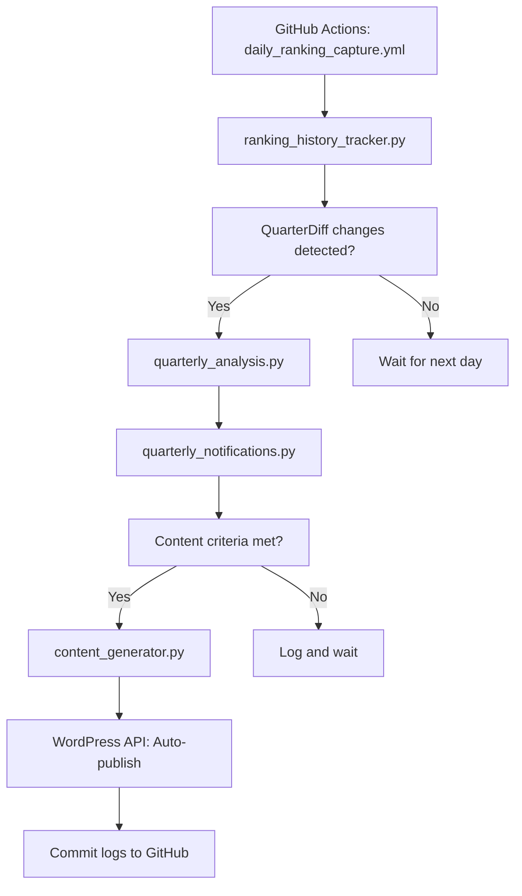

# Automated Content Marketing Plan for Indicatum

## ⚠️ **IMPORTANT DATA COMPATIBILITY NOTE**
**This content marketing plan was created based on the current system outputs and requires updates to align with the new PIPELINE_REDESIGN architecture.**

### **Data Source Validation Required**
Before implementing any content generation features:
1. **Verify data availability** against the PIPELINE_REDESIGN document outputs
2. **Check field compatibility** between expected content inputs and actual pipeline outputs  
3. **Update data mappings** to match new three-temporal-perspective structure
4. **Confirm trigger mechanisms** exist in the redesigned pipeline for content automation

### **Current Misalignments Identified:**
- Content plan expects `stock_evaluation_results.csv` → Pipeline outputs `cluster_rankings.pkl`
- Content plan expects `QuarterDiff` field → Not defined in PIPELINE_REDESIGN
- Content plan expects single rankings → Pipeline has three perspectives per ratio
- Content plan expects traditional column names → Pipeline has new naming convention

**Always reference PIPELINE_REDESIGN document before implementing content features to ensure data compatibility.**

---

## Overview
Merge lean marketing approach with automated content generation using your stock analysis data to create a self-sustaining marketing engine.

---

## Content Generation Strategy

### **1. Two-Tier Analysis System**

#### **Weekly Market Reports** → **PUBLIC (Lead Generation)**
- **Data Source:** `stock_evaluation_results.csv` (fundamental rankings) + weekly price data
- **Content:** "Veckans Marknadsavvikelser" - Fundamental vs price divergences within sectors
- **Analysis Type:** 
  - **Undervalued Movers:** High sector ranking + below sector average price performance
  - **Overvalued Warnings:** Low sector ranking + above sector average price performance  
  - **Hidden Gems:** High sector ranking + significantly below sector average performance
  - **Sector Momentum:** Which sectors show best fundamental + price alignment
- **Timeframe:** Rolling 4-week lookback for price performance, published weekly
- **Format:** Blog post + Email newsletter (all subscribers)
- **Purpose:** Identify market inefficiencies where price doesn't match fundamental strength
- **Competitive angle:** "Smarta avvikelser på 5 minuter vs timmar av sektoranalys"
- **Distribution:** Wide - Blog, social media, SEO content
- **Teaser strategy:** Show positions 4-10 publicly, top 3 require free signup

##### **Content Template:**
```
Title: "Veckans Marknadsavvikelser: [Date] - Smarta Möjligheter i 5 Minuter"

Content Structure:
1. Executive Summary (market vs fundamentals overview)
2. Undervärderada Rörelser (positions 4-10 shown publicly)
   → "Stark fundamenta, sektorn har inte hängt med än - upptäckt med AI-analys"
3. Övervärderingsvarningar (risky stocks outperforming sector despite weak fundamentals)
   → "Svag fundamenta, priset sprungit före verkligheten - vårt system varnade tidigt"
4. Dolda Pärlor (excellent fundamentals, temporarily underperforming sector)
   → "Marknadspanik möter stark fundamenta - kontrariska möjligheter"
5. Sektormomentum (sectors with best fundamental + price alignment)
   → "Sektorrotation i realtid - inte månader senare"
6. CTA: "Se topp 3 i varje kategori + analysera själv - registrera dig gratis"
```


## 🔄 **Earnings Impact Analysis Integration**

### Core Data Detection Engine
The earnings impact analysis is powered by three interconnected Python modules that form the foundation of automated content generation:

```
Stock Rankings → quarterly_analysis.py → quarterly_notifications.py
        ↓                    ↓                      ↓
ranking_history_tracker.py ← Analysis Results → content_generator.py
                                                         ↓
                                                WordPress API → Blog Post
```

#### **ranking_history_tracker.py** - Foundation Layer
- **Earnings Detection**: `detect_quarter_diff_changes()` monitors QuarterDiff field changes
- **Snapshot Capture**: `capture_quarterly_triggered_rankings()` stores before/after earnings data
- **Time-Series Database**: Normalized SQLite schema `(ticker, date, dimension, value, capture_type)`
- **Historical Trends**: Provides data depth for content generation
- **Significant Jump Detection**: `get_significant_jumps()` identifies major ranking movements

#### **quarterly_analysis.py** - Analysis Engine  
- **Impact Processing**: Analyzes ranking changes post-earnings announcements
- **Content Opportunities**: Identifies significant moves worth writing about
- **Output Generation**: Creates `quarterly_changes_analysis.txt` with structured insights
- **Swedish Market Focus**: Stockholm Exchange specialization (.ST suffix)
- **Performance Ranking**: Sorts stocks by ROE TTM changes and sector performance
- **Report Structure**: Top performers, underperformers, and sector trends

#### **quarterly_notifications.py** - Content Trigger System
- **Event Detection**: Evaluates earnings impact significance using quality thresholds
- **Content Worthiness**: `should_trigger_content_generation()` applies criteria:
  - Minimum 2 high-priority stocks
  - At least 5 total stocks with changes
  - Average ranking score above 70.0
- **Automated Triggering**: `trigger_content_generation()` launches content pipeline
- **Integration Point**: Bridges analysis detection with content creation

#### **content_generator.py** - Blog Post Automation
- **Content Creation**: Transforms analysis data into Swedish blog posts
- **WordPress Integration**: REST API publishing with authentication
- **Quality Control**: Bypasses thresholds only with `FORCE_CONTENT=true`
- **SEO Optimization**: Swedish keywords, meta descriptions, internal linking
- **Content Structure**: Introduction, analysis sections, stock highlights, conclusion

### Integration with GitHub Actions
```yaml
# Updated .github/workflows/daily_ranking_capture.yml (04:30 UTC)
1. Detects QuarterDiff changes in daily data
2. Captures before/after snapshots via ranking_history_tracker.py
3. Runs quarterly_analysis.py to generate insights
4. Executes quarterly_notifications.py to evaluate content worthiness
5. If criteria met, triggers content_generator.py
6. Publishes blog post via WordPress API
7. Commits logs and analysis files to repository
```

### Content Generation Workflow



## 📝 **Automated Blog Post Creation System**
- **Data Source:** `QuarterDiff` triggered analysis of TTM metric changes
- **Content:** "ANALYS: [Company] Kvartalsrapport Visar Betydande TTM-förbättring"
- **Analysis Type:**
  - Automated detection and ranking of significant TTM changes
  - ROE, Revenue, EPS impact analysis with clear rankings and context
  - Digestible insights from complex quarterly data (what matters vs noise)
- **Format:** Structured email analysis to premium users only
- **Purpose:** Transform complex quarterly reports into clear, ranked investment insights
- **Competitive angle:** "Automatisk analys och ranking - medan andra fortfarande läser rapporten manuellt"
- **Distribution:** Premium subscribers only - triggered when significant improvements detected
- **Public teaser:** "Premium users got automated analysis while others were still reading the report"

##### **Content Template:**
```
Subject: "🎯 Automatisk Analys: [Company] TTM-Förbättring Identifierad"

Content:
- Alert Details: Quarterly report published [Date], data now in Yahoo Finance
- Key Discovery: "Vår AI upptäckte automatiskt: TTM EPS +34%, Revenue +18%"
- Ranking Impact: "Ranking jump: Lönsamhet #67 → #31"
- Competitive Advantage: "Medan andra läser 40-sidors rapport manuellt, får du key insights på 30 sekunder"
- Analysis Quality: "Automatisk ranking av 50+ nyckeltal vs timmar av förvirring"
- Link to analyze: "Se fullständig automatisk analys i appen"
- Disclaimer: "Data från Yahoo Finance, analys från Indicatum AI"
```

#### **"Smart Simplicity" Series** → **PUBLIC (Competitive Positioning)**
- **Source:** User behavior data, competitive comparisons
- **Content:** "Varför mindre data ger bättre resultat" anti-complexity messaging
- **Format:** Educational blog posts + Email course (all subscribers)
- **Automation:** Monthly competitive positioning content
- **Competitive angle:** Direct positioning against Börsdata complexity
- **Distribution:** Maximum reach - Blog, LinkedIn, Reddit, wherever competitors' users gather

#### **"Mobile-First Analysis" Series** → **PUBLIC (Platform Advantage)**
- **Source:** User behavior patterns, mobile usage analytics
- **Content:** "Aktieanalys på språng vs kedjade vid skrivbordet"
- **Analysis Type:**
  - Mobile stock screening while commuting vs desktop-bound analysis
  - "Lunchpausen-analys" - quick mobile insights vs hours at computer
  - Usage pattern data: when and where users actually analyze stocks
- **Format:** Blog posts, social content, app store positioning
- **Competitive angle:** "Börsdata kräver skrivbord. Vi fungerar på tunnelbanan."
- **Distribution:** Mobile-focused channels, app store optimization, commuter-targeted content

---

## Content Funnel Strategy

### **Public Content → Lead Generation**
**Goal:** Attract and demonstrate value

#### **Top of Funnel (Awareness):**
- **"Smart Simplicity" Series** - Attract frustrated Börsdata users
- **Monthly Sector Analysis** - SEO content for Swedish stock searchers
- **Social media teasers** - "Here's what our Premium users understood while others were still confused..."

#### **Middle of Funnel (Interest):**
- **Weekly Market Reports** - Show AI ranking capabilities
- **Email signup incentive** - "Get weekly insights + automated earnings analysis"
- **Beta access positioning** - "Join exclusive beta community"

### **Premium Content → Conversion & Retention**
**Goal:** Justify subscription and reduce churn

#### **Bottom of Funnel (Decision):**
- **Automated Earnings Impact Analysis** - Exclusive analytical advantage
- **Premium email templates** - "This insight saved Premium user $X,000"
- **Community access** - Early feature feedback, priority support

#### **Retention (Loyalty):**
- **Consistent alert value** - Regular quarterly opportunities
- **Success stories** - "Premium user caught this before market reacted"
- **Feature previews** - First access to new analysis tools

### **Content Teasers for Conversion**
- **Blog posts:** "Premium users got automated analysis while others were still reading the 40-page report"
- **Social media:** "Our AI ranked this quarterly report's impact instantly. Others are still on page 5. 🤖"
- **Mobile advantage:** "Börsdata users are chained to their desks. Our users analyze on the train. 📱"
- **Email footers:** "Upgrade to Premium for automated quarterly analysis"
- **App integration:** "This stock just triggered an automated improvement alert - upgrade to see analysis"

---

## Distribution Channels

### **Primary: Blog + MailPoet Email**
#### **Blog Posts (WordPress)**
- SEO-optimized articles on indicatum.se
- Categories: Weekly Reports, Sector Analysis, Market Insights
- Auto-generated from data analysis
- Include charts/visualizations from your app

#### **Email Newsletter (MailPoet)**
- **Weekly Digest:** Summary of blog content + key insights
- **Alerts:** Real-time opportunities 
- **Premium Content:** Exclusive deep-dives for paid subscribers
- **Segmentation:** Beta users vs Premium vs prospects

### **Secondary Channels**

#### **LinkedIn (Automated + Competitive)**
- Auto-post blog summaries to LinkedIn
- **New:** Anti-complexity messaging targeting finance professionals
- **Content themes:** "Less is More in Stock Analysis", "Why Simple Beats Complex"
- Include teaser + link back to full blog post
- **Target:** Börsdata users frustrated with complexity

#### **Reddit (Strategic Positioning)**
- r/SecurityAnalysis, r/investing, r/ValueInvesting
- **New:** r/Sverige financial communities
- Share findings with **comparative context** ("Unlike complex tools, here's simple insight...")
- Build reputation as **simplicity advocate** in analysis

#### **Twitter/X (Competitive Messaging)**
- Tweet key insights from weekly reports
- **New:** Regular "Complexity vs Clarity" threads
- **Example:** "Börsdata gives you 1000+ metrics. We give you the 4 that matter. Here's why:"
- Include charts comparing time-to-insight

#### **YouTube/TikTok (Future)**
- **New channel idea:** "5-Minute Mobile Stock Analysis" 
- Show Indicatum mobile insights vs Börsdata desktop complexity side-by-side
- "Clear insights vs information overload" content series
- **Mobile focus:** "Aktieanalys på pendeltåget vs 3 timmar vid skrivbordet"

---

## Mobile-First Competitive Strategy

### **Platform Positioning Against Börsdata**
**Core Message:** "While competitors keep you chained to your desk, we put market insights in your pocket"

#### **Behavioral Advantages:**
- **Commute Analysis:** Users can screen stocks during train rides, not just at desktop
- **Lunch Break Insights:** Quick mobile filtering vs hours of desktop spreadsheet analysis  
- **Anywhere Access:** Beach vacation stock check vs office-bound analysis
- **Real Usage Patterns:** People check phones 100+ times/day, rarely sit at computers for hours

#### **Content Messaging:**
- **"Tunnelbane-analys vs Skrivbords-slaveri"** - Mobile freedom vs desktop chains
- **"5 minuter på mobilen vs 3 timmar vid datorn"** - Time efficiency through mobile simplicity
- **"Börsdata kräver kontorsstol. Vi fungerar i hängmattan."** - Lifestyle positioning

#### **Marketing Channels for Mobile Message:**
- **LinkedIn commuter content:** Target during peak commute hours (07:00-09:00, 17:00-19:00)
- **Instagram Stories:** Show real mobile usage scenarios
- **App Store optimization:** "Mobile stock analysis" vs "Desktop financial tools"
- **Podcast advertising:** Target commuter-heavy shows

---

## System Architecture for Three-Tier Analysis

### **Data Flow Implementation**
```
Weekly Snapshots    Monthly Trends         Automated Analysis
     ↓                   ↓                      ↓
stock_evaluation_   ranking_history.db   QuarterDiff triggers
results.csv         (time-series)        (TTM changes)
     ↓                   ↓                      ↓
Top 10 Lists       Trend Analysis        Impact Analysis
     ↓                   ↓                      ↓
Public Content     Authority Content     Premium Insights
```

### **Content Generation Efficiency**
- **Weekly:** Simple ranking extracts from existing CSV - minimal processing
- **Monthly:** Time-series queries on existing database - leverages current infrastructure  
- **Automated Analysis:** Triggered by existing `QuarterDiff` system whenever significant changes detected
- **All three:** Use existing data sources - no new data collection needed

---

## Technical Implementation

### **Quarterly Report Detection System**
#### **Data Monitoring:**
```python
def detect_quarterly_updates():
    """
    Compare current TTM data with previous snapshot (1-2 day lag from Yahoo Finance)
    Flag stocks with fresh quarterly data showing significant improvements
    """
    # Detection triggers:
    # 1. New TTM data appears (indicates Yahoo Finance updated from quarterly report)
    # 2. TTM Revenue growth >15% vs previous quarter
    # 3. TTM EPS improvement >20% vs previous quarter  
    # 4. Ranking jump >10 positions in any category
    # 5. Multiple metric improvements simultaneously
    
def generate_quarterly_alerts(detected_stocks):
    """
    Auto-generate analysis and insights from quarterly improvements
    Create email alerts and blog content with AI-driven conclusions
    Focus on speed of analysis, not speed of data availability
    """
    pass
```

#### **Alert Content Templates:**
- **Structured Email:** "🎯 Automatisk Analys: [Company] TTM-ranking förbättrad"
- **Blog Post:** "AI-Analys: [Company] Kvartalsrapport visar stark utveckling"
- **Weekly Roundup:** "Veckans Kvartalsrapporter: 5 Bolag Som Överraskade Positivt"

### Implementation Steps (COMPLETED)

#### ✅ Step 1: Content Generator Script
**File Created**: `content_generator.py` - Automated article creation system

**Key Features**:
- **Data Parsing**: Extracts insights from `quarterly_changes_analysis.txt`
- **Content Templates**: Swedish-language blog post structure with SEO optimization
- **Quality Thresholds**: Minimum criteria for content worthiness:
  - 5+ total stocks with quarterly updates
  - 3+ top performers identified
  - 2+ sectors represented
  - Fresh data from current day
- **WordPress Integration**: REST API publishing with authentication
- **Content Structure**:
  - Dynamic titles with stock counts and date
  - Introduction explaining quarterly impact
  - Top performers section (Kvartalsvinnarerna)
  - Underperformers section (Aktier att bevaka)
  - Sector trends analysis (Sektortrender)
  - SEO-optimized conclusion with CTA
- **Error Handling**: Comprehensive logging and fallback mechanisms

#### ✅ Step 2: Enhanced Quarterly Notifications
**File Updated**: `quarterly_notifications.py` - Integration with content pipeline

**New Functions**:
- `should_trigger_content_generation()`: Evaluates content worthiness
- `trigger_content_generation()`: Launches automated blog post creation
- `process_quarterly_notifications_with_content()`: Main workflow coordinator
- **Criteria System**: Multi-threshold approach for quality control
- **Subprocess Management**: Safe execution of content generator with timeout
- **Results Tracking**: Comprehensive logging of generation success/failure

#### ✅ Step 3: GitHub Actions Workflows
**Files Created/Updated**:

**New**: `.github/workflows/content_automation.yml`
- Standalone content generation workflow
- Manual trigger capability with force override
- WordPress credentials integration
- Automated commit of generation logs

**Updated**: `.github/workflows/daily_ranking_capture.yml`
- Integrated content generation check
- WordPress environment variables
- Enhanced commit process including content logs

#### ✅ Step 4: Automated Content Marketing Plan
**File Updated**: `planning/to_be_done/automated_content_marketing_plan.md`
- Complete technical integration documentation
- Workflow diagrams and data flow
- Implementation status and next steps

### Content Generation Flow (IMPLEMENTED)

```python
# Daily automation sequence:
1. GitHub Actions: daily_ranking_capture.yml (04:30 UTC)
2. ranking_history_tracker.py: Detect QuarterDiff changes
3. quarterly_analysis.py: Generate insights and analysis
4. quarterly_notifications.py: Evaluate content worthiness
5. content_generator.py: Create and publish blog post (if criteria met)
6. Git commit: Logs and analysis files updated
```

**Environment Variables Required**:
```bash
WORDPRESS_URL=https://indicatum.se
WORDPRESS_USER=your_wp_username  
WORDPRESS_APP_PASSWORD=your_app_specific_password
ENVIRONMENT=remote  # for GitHub Actions
FORCE_CONTENT=true  # optional override for testing
```

### Content Quality Control (IMPLEMENTED)

#### Automated Thresholds ✅
- **Minimum 5 stocks** with quarterly updates before content creation
- **Fresh data only**: Analysis must be from current day
- **Multi-criteria evaluation**: At least 3 of 4 quality criteria must be met
- **Swedish market focus**: Stockholm Exchange stocks (.ST suffix) only
- **Sector diversity**: Ensures multiple sectors represented in analysis

#### Manual Override Capability ✅
- **Environment variable** `FORCE_CONTENT=true` bypasses all thresholds
- **Workflow dispatch**: Manual trigger through GitHub Actions interface
- **Draft mode option**: Can be configured to publish as draft for review
- **Comprehensive logging**: All decisions and actions logged for monitoring

#### SEO Optimization ✅
- **Swedish keywords**: "kvartalsrapporter", "svenska aktier", "aktieanalys", "stockholm börsen"
- **Long-tail targeting**: "kvartalsresultat", "aktierankningar", "ROE analys"
- **Internal linking**: Automatic links to aktiefilter tool
- **Meta descriptions**: Generated from analysis summary
- **Structured content**: H2/H3 headers, bullet points, bold highlights

### Technical Implementation Status

#### ✅ COMPLETED: Core Content Generation System
1. **Data Detection**: QuarterDiff monitoring in ranking_history_tracker.py
2. **Analysis Engine**: Quarterly impact analysis in quarterly_analysis.py  
3. **Content Creation**: Automated blog post generation in content_generator.py
4. **Publishing Pipeline**: WordPress REST API integration
5. **Quality Control**: Multi-threshold content worthiness evaluation
6. **GitHub Integration**: Automated workflows with logging and commits

#### 🔄 IN PROGRESS: WordPress Configuration
- **Secrets Setup**: Configure WordPress credentials in GitHub secrets
- **Category IDs**: Update content_generator.py with actual WordPress category IDs
- **Testing**: Manual trigger testing with FORCE_CONTENT=true

#### 📋 NEXT: Content Monitoring & Optimization
- **Performance Tracking**: Monitor published post engagement
- **Content Iteration**: Refine Swedish language and SEO optimization
- **Social Integration**: Add automated social media posting
- **Email Newsletter**: Integrate with MailPoet for subscriber notifications
```
GitHub Actions → Generate Analysis Data → WordPress API → Auto-Create Blog Post → MailPoet Auto-Send
```

1. **Extend GitHub Actions workflow:**
   - Add content generation step after data analysis
   - Create markdown/JSON output with insights
   - Use OpenAI API to generate readable content from data

2. **WordPress Integration:**
   - REST API to auto-create blog posts
   - Custom post types for different content categories
   - Auto-categorization and tagging

3. **MailPoet Setup:**
   - Auto-send new blog posts to subscribers
   - Segment lists (Beta, Premium, Prospects)
   - Template design matching brand

### **Phase 2: Multi-Channel Automation**
```
WordPress → Zapier/Make.com → LinkedIn/Twitter/Other Channels
```

4. **Social Media Automation:**
   - Zapier connects WordPress to LinkedIn/Twitter
   - Auto-generate social posts from blog content
   - Different content formats per platform

5. **Advanced Segmentation:**
   - Behavioral triggers (app usage, engagement)
   - Personalized content based on user preferences
   - A/B testing for subject lines and content

---

## Content Calendar Automation

### **Weekly Schedule**
- **Monday:** Weekend analysis processing (GitHub Actions)
- **Tuesday:** Auto-generate weekly report blog post + Check for quarterly report alerts
- **Tuesday Evening:** MailPoet auto-send weekly newsletter
- **Wednesday:** LinkedIn auto-post summary + Any quarterly alerts from Tuesday
- **Thursday:** Twitter thread with key insights
- **Friday:** Process any new quarterly alerts for next week
- **Daily:** Monitor for fresh quarterly reports and TTM improvements

### **Monthly**
- **First Monday:** Generate monthly sector analysis
- **Mid-month:** Quarterly report roundup if sufficient data
- **As needed:** Automated quarterly analysis (triggered when significant changes detected)

---

## Metrics & Optimization

### **Content Performance**
- **Email:** Open rates, click-through rates, unsubscribe rates
- **Blog:** Page views, time on page, bounce rate
- **Social:** Engagement rates, follower growth, click-through
- **App:** Traffic from content, conversion to trials/premium
- **Competitive:** Brand mentions vs Börsdata, user migration tracking

### **Growth Indicators**
- **Email list growth** (target: 100-200 subscribers/month)
- **Blog traffic growth** (target: 1000+ monthly visitors)
- **Social media growth** (target: 100+ followers/month)
- **App trial conversions** from content (target: 10%+ conversion)
- **Competitive wins** (target: 5-10 Börsdata migrations/month)

---

## Budget & Resources

### **Costs (Monthly)**
- **OpenAI API:** ~200-500 kr (content generation)
- **Zapier/Make.com:** ~200 kr (automation)
- **WordPress hosting:** Already covered
- **MailPoet:** Free up to 1000 subscribers
- **Total:** ~400-700 kr/month

### **Time Investment**
- **Initial setup:** 2-3 days
- **Weekly maintenance:** 1-2 hours (review/adjust)
- **Content review:** 30 min/week (quality check)
- **Monthly optimization:** 2-3 hours

---

## Success Criteria (Revised - Realistic)

### **3-Month Goals**
- ✅ **100-200 email subscribers** (organic growth from quality content)
- ✅ **1000+ monthly blog visitors** (SEO + consistent publishing)
- ✅ **20-30 beta trial signups from content** (realistic conversion rate)
- ✅ **Fully automated weekly content pipeline** (technical achievement)

### **6-Month Goals**
- ✅ **500-800 email subscribers** (steady growth, word of mouth)
- ✅ **3000+ monthly blog visitors** (SEO maturity + backlinks)
- ✅ **50-75 premium conversions** (17-26k kr/month revenue)
- ✅ **Recognition in Swedish investing community** (Reddit, forums mentions)

### **12-Month Goals**
- ✅ **1500-2500 email subscribers** (established audience)
- ✅ **8000+ monthly blog visitors** (strong SEO presence)
- ✅ **200-300 premium subscribers** (70-105k kr/month revenue)
- ✅ **Established thought leadership** (media mentions, speaking opportunities)

---

## Risk Mitigation

### **Content Quality**
- **Human oversight:** Always review AI-generated content
- **Fact-checking:** Verify all data claims
- **Disclaimer:** Clear investment advice disclaimers

### **Technical Reliability**
- **Backup systems:** Manual fallback if automation fails
- **Monitoring:** Alerts if content generation fails
- **Version control:** Track all automated content changes

### **Audience Building**
- **Value-first approach:** Always provide actionable insights
- **No spam:** Quality over quantity in email frequency
- **Engagement focus:** Respond to comments and questions

---

## Next Steps

1. **Week 1:** Set up WordPress REST API integration
2. **Week 2:** Extend GitHub Actions for content generation
3. **Week 3:** Configure MailPoet automation
4. **Week 4:** Test full pipeline with sample content
5. **Week 5:** Launch with first weekly report
6. **Week 6-8:** Monitor, optimize, add social media automation

This creates a **sustainable, scalable content marketing engine** that turns your data analysis into valuable content that attracts and converts users while requiring minimal ongoing effort from you.
